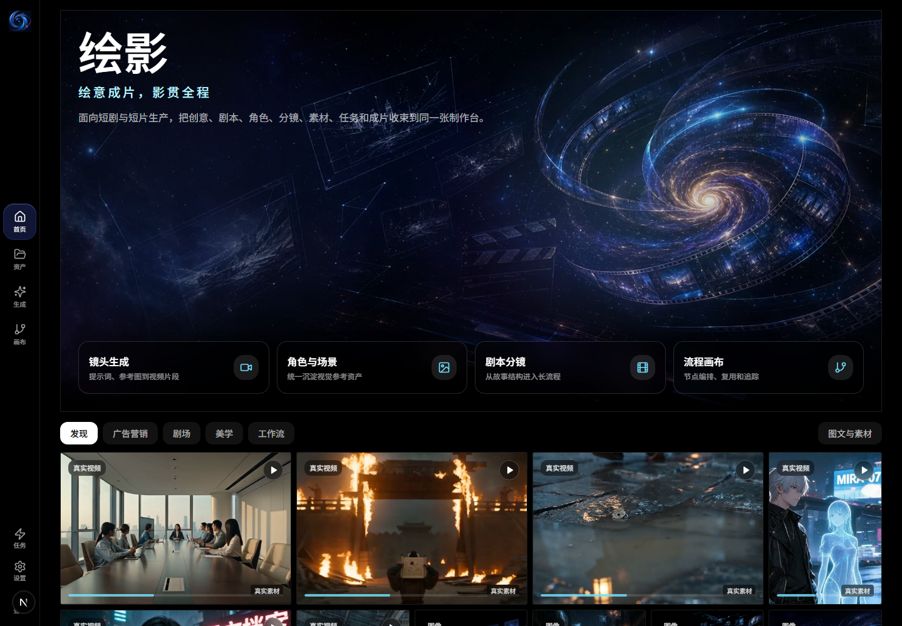
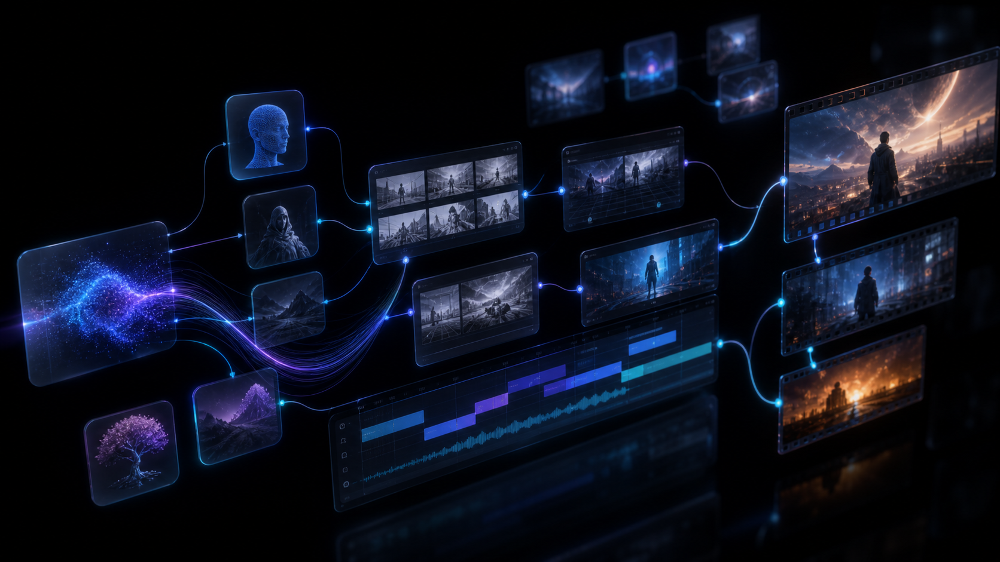
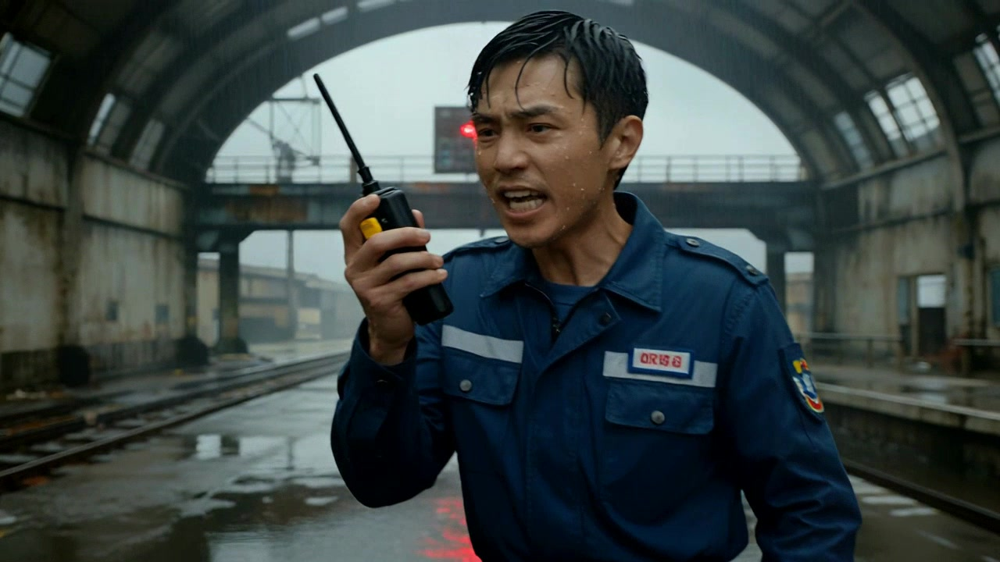
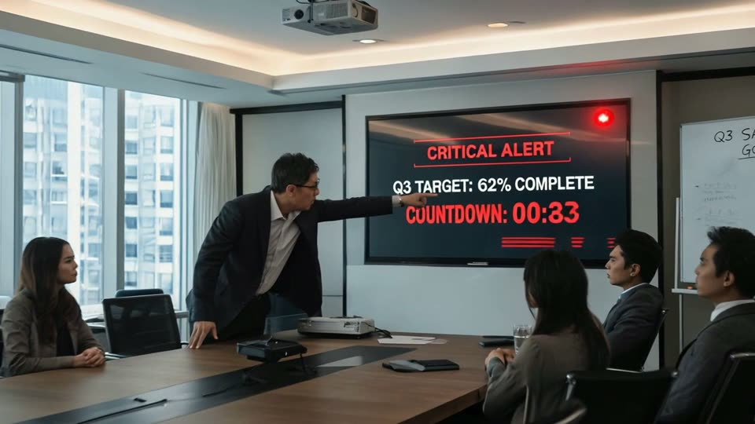

# TashanScene

TashanScene 是面向短剧、预告片和商业短片制作的 AI 影像工作台。它把创意、剧本、角色、场景、道具、分镜、尾帧承接、声音状态、素材资产、任务恢复和成片交付收束到同一个生产界面。



## 使用截图

| 工作台 | 制作控制台 | 工作流画布 |
| --- | --- | --- |
|  |  |  |

| 电影感首页 | 角色导演 | 商业广告 |
| --- | --- | --- |
|  |  |  |

| 故事雨景 | 60 秒成片海报 | 分镜样片海报 |
| --- | --- | --- |
|  |  |  |

## 生成视频样片

下面是从本地已有生成结果压缩出的 8 秒预览样片，便于在 GitHub 首页快速判断真实视频质感。完整视频素材不放入 main 分支，避免仓库体积膨胀。

<video src="docs/media/tashanscene-generated-sample.mp4" controls poster="docs/media/tashanscene-generated-sample-poster.jpg" width="720"></video>

[打开 MP4 样片](docs/media/tashanscene-generated-sample.mp4)



## 当前状态

| 项目 | 状态 |
| --- | --- |
| 仓库 | 他山版本，当前未绑定公网演示地址 |
| 运行形态 | Next.js 应用；典型部署为 `tashanscene.service` + `nginx` |
| 健康检查 | 部署后检查页面、`/api/health`、媒体库和制作案例接口 |
| 稳定边界 | README 记录的是工程入口、媒体展示和任务接口；真实视频生成、费用确认和 ViMAX 主链路需单独走 QA 门控 |

## 核心能力

- **短片制作台**：从创意、剧本、角色和场景进入分镜、镜头、任务和交付资产。
- **分段视频链路**：管理尾帧承接、片段恢复、合成失败和长任务状态。
- **资产库**：同步历史图片、视频、封面和制作案例；封面优先加载，视频按需打开。
- **任务中心**：长任务进入队列，支持轮询、SSE、取消、重试和恢复。
- **工作流画布**：把剧本、分镜、图片、视频、音频和质量节点纳入可审计流程。

## 架构概览

```text
浏览器工作台
  -> Next.js 页面与 API 路由
  -> 任务中心与 production assembly 队列
  -> provider boundary 与模型路由
  -> 媒体库、封面、对象存储和生成资产
  -> 时长、恢复、handoff、readiness QA 脚本
```

## 快速开始

```bash
pnpm install
pnpm dev
```

打开 [http://localhost:5000](http://localhost:5000)。

生产构建：

```bash
pnpm build
pnpm start
```

## 关键配置

| 范围 | 环境变量 |
| --- | --- |
| 子路径部署 | `NEXT_PUBLIC_APP_BASE_PATH`, `TASHANSCENE_BASE_URL` |
| 模型网关 | `OPENAI_COMPAT_*`, `ARK_*` 和供应商专用 base/model 变量 |
| 真实视频 QA | `TASHANSCENE_REAL_ARK_API_BASE`, `TASHANSCENE_REAL_ARK_API_KEY`, `TASHANSCENE_REAL_ARK_VIDEO_MODEL`, `TASHANSCENE_ALLOW_REAL_VIDEO_COST` |
| 对象存储 | `TASHANSCENE_OBJECT_STORAGE_ENDPOINT_URL`, `TASHANSCENE_OBJECT_STORAGE_BUCKET_NAME`, `TASHANSCENE_OBJECT_STORAGE_ACCESS_KEY_ID`, `TASHANSCENE_OBJECT_STORAGE_SECRET_ACCESS_KEY` |
| 公网资产 | `TASHANSCENE_PUBLIC_ASSET_BASE_URL` |

密钥只能放在本地 shell、CI Secret 或部署平台。不要提交 API Key、token、生成视频、完整签名 URL 或 release 备份目录。

## 验证

按改动范围选择最小验证：

```bash
pnpm run ts-check
pnpm run lint:build
pnpm validate
```

高信号 QA：

| 命令 | 用途 |
| --- | --- |
| `pnpm run qa:video-byok` | 用 dummy 凭证验证视频路由边界，不调用真实供应商 |
| `pnpm run qa:production-readiness` | 检查真实分段 handoff 的运行前提 |
| `pnpm run qa:video-recovery` | 验证合成失败时片段资产不丢 |
| `pnpm run qa:tasks` | 验证任务列表、详情、SSE、取消、重试和恢复 |
| `pnpm run qa:flow` | 验证创意到分镜 dry-run 与任务写回 |
| `pnpm run qa:video-duration -- artifacts/example.mp4` | 解析真实媒体时长，不只信任务字段 |
| `pnpm run qa:real-video-gate` | 只有显式成本授权时才运行真实视频门控 |
| `pnpm run qa:real-segment-handoff` | 验证真实两段尾帧承接，会调用真实供应商并可能产生费用 |

真实供应商测试必须显式授权、顺序执行、逐级放量。没有 5 秒 smoke、两段 handoff 和对象存储 readiness 证据时，不直接跑 60 秒以上回归。

## 产品边界

- ViMAX 主链路、费用确认、真实 Seedance/Seedream 调用、视频生成策略、边界桥接和短剧验收逻辑要和普通 UI 打磨隔离。
- 长耗时生成必须进入任务系统，按钮不能无限 loading。
- 1 分钟以上视频按低成本阶梯推进：路由/dry-run -> 最小文本 -> 最小图片 -> 5s -> 10s -> 15s -> 30s -> 60s -> 60s+。
- 视频任务必须下载或探测结果文件并解析真实媒体时长，不能只看请求字段。

## 部署

生产发布建议使用 release 目录和 current symlink：先构建新 release，再切换 symlink、重启服务、探测公网路由；健康失败立即回滚。

部署后最小探针：

```bash
curl -I https://example.com/tashanscene
curl -s https://example.com/tashanscene/api/health
curl -I "https://example.com/tashanscene/api/assets/media-library?limit=3"
```

媒体或路由变更后，还要抽样检查静态资源 `Content-Type`。破图或空视频卡片常见原因是资源 URL 返回了 HTML。

## 目录结构

```text
src/app/          Next.js 页面与 API 路由
src/components/   产品面板、工作台 UI 和 shadcn/ui 组件
src/lib/          provider、媒体、任务、production 和存储工具
scripts/          QA、smoke、恢复和发布辅助脚本
docs/             QA 记录、发布说明、源码对齐和截图
```

## 开发约定

- 使用 `pnpm`，不要使用 `npm` 或 `yarn`。
- 优先复用现有产品组件和 UI 模式。
- provider、任务、媒体和 ViMAX 边界附近保持小步改动。
- 不做无关的大范围格式化。
- UI 媒体加载改动必须同时验证 API 响应和代表性资源 `Content-Type`。

## 安全

不要在公开 issue 或提交中放入密钥、私有模型凭证、用户生成媒体、完整签名 URL 或付费供应商请求 payload。敏感问题请私下报告给仓库维护者。
