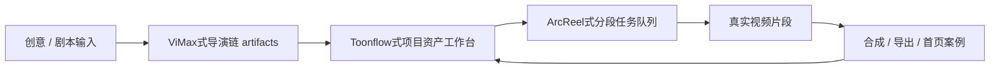

# TashanScene参考开源项目完整提升方案

更新时间：2026-06-17

本方案把 `ViMax`、`Toonflow-app`、`ArcReel` 的源码级能力转化为TashanScene自己的产品升级路线。`60s+` 短剧是关键验收项，但不是唯一目标；真正目标是让TashanScene从“功能集合 + 任务工程补课”升级为“可发布、可交付、用户能完成短剧/短片制作全流程的产品”。

## 总体目标

TashanScene下一阶段要形成三层能力：

1. **创作智能层**：用户输入创意或剧本后，系统能产出故事结构、角色、冲突、分镜、镜头节奏和连续性约束。
2. **制作工作台层**：剧本、角色、场景、道具、分镜、片段、任务和成片都是可见、可编辑、可复用的项目资产。
3. **生成工程层**：BYOK 真实可用，任务可排队、可轮询、可恢复、可合成、可导出；长任务有阶段反馈，失败不丢中间成果。

## 三个开源项目的定位

| 参考项目 | TashanScene应该学习什么 | 不应该照搬什么 | TashanScene落地目标 |
| --- | --- | --- | --- |
| ViMax | 多 Agent 创作链路、故事到剧本到角色到分镜到视频的 artifact-first pipeline、角色多视角一致性、首尾帧连续性、工具调用事件流 | 不照搬 Python pipeline 结构和命名；不把TashanScene精灵做成科研 demo 式命令行流程 | 把TashanScene精灵升级为导演链：导演、编剧、制片、镜头设计、连续性监督，各自产出结构化 artifact |
| Toonflow-app | 项目级工作台、资产/剧本/分镜/视频节点组织、项目级 artStyle/directorManual/model/mode、agent memory、画布式资产复用 | 不照搬 UI 和数据库结构；不把TashanScene做成只有画布的编辑器 | 把 `/node-editor` 和影视创作页变成真正的制作工作台，节点能写回项目资产 |
| ArcReel | 剧本到视频任务队列、供应商解析、任务状态、失败恢复、成功片段持久化、剪辑工程导出 | 不照搬后端语言和全部 provider 体系；不一次性重写任务系统 | 把 `assemblyPlan` 推进成可执行子任务队列，并实现片段资产库、合成、导出包 |

## TashanScene当前基础

已经具备的能力：

- `ProductionProject`：项目级故事、资产、阶段、graph、storyboard、output 雏形。
- `ProductionStoryBible`：主角、欲望、阻碍、冲突、转折、钩子、情绪弧线、beats。
- `DirectorChainResult`：导演、编剧、制片、镜头设计四角色结构化输出。
- `ProductionCanvas`：能把脚本、分镜、角色、场景、视频片段和 Agent 映射到画布节点。
- `ProductionAssemblyPlan`：能把 story-aware storyboard 转成分段计划。
- 任务中心：能回看 `assemblyPlan`、片段子任务、失败原因和重试入口。
- BYOK/Ark：已有真实调用基础和视频时长验证经验。

核心不足：

- 项目资产仍主要挂在任务结果上，不是长期可编辑项目。
- 导演链仍偏确定性规则，不是真正 agent 工作流。
- 画布节点只能展示，不能完整写回项目数据。
- 成功片段没有沉淀为素材库、首页案例和后续生成参考。
- `60s+` 需要稳定验证实际媒体时长和剧情质量，而不仅是接口时长参数。
- 导出能力还停在合成，不足以交付剪辑工程。

## 升级路线总览



每轮迭代必须落在这条链路上，格式固定为：

```text
参考项目能力 -> TashanScene模块 -> 前端/后端/数据流改造 -> 真实验证证据
```

## 阶段 1：项目级制作模型升级

参考来源：Toonflow-app 项目模型 + ViMax artifact pipeline。

### 要解决的问题

TashanScene现在的 `ProductionProject` 已经有结构，但它多半来自单次任务，用户不能像管理一个项目那样持续编辑和复用。

### 改造内容

后端：

- 新增项目 API：
  - `GET /api/production/projects`
  - `POST /api/production/projects`
  - `GET /api/production/projects/[projectId]`
  - `PATCH /api/production/projects/[projectId]`
- 项目字段对齐 Toonflow 的关键项：
  - `title`
  - `intro`
  - `projectType`
  - `artStyle`
  - `directorManual`
  - `ratio`
  - `imageModel`
  - `videoModel`
  - `mode`
  - `createdAt`
  - `updatedAt`
- 把 `productionProject.assets/storyboard/output` 从一次性结果升级为可保存实体。

前端：

- 首页“开始创作”进入项目创建，而不是直接进入孤立生成。
- `film` 页面显示当前项目的故事、角色、场景、道具、分镜、任务状态。
- `tasks` 中每个任务必须回链到 projectId。

验收：

- 创建一个短剧项目后，刷新页面仍能看到项目、角色、分镜和任务。
- `qa:short-drama` 扩展为项目级校验：不仅检查 task result，还检查 project asset 存在。

## 阶段 2：TashanScene精灵导演链升级

参考来源：ViMax agent runtime + Toonflow script/production subagents。

### 要解决的问题

当前导演链只是规则函数，能产生结构化文本，但不具备可执行、可审计、可修订的 Agent 工作流。

### 改造内容

后端：

- `DirectorChainResult.agents[]` 增加：
  - `artifactId`
  - `inputAssetIds`
  - `outputAssetIds`
  - `status`
  - `revisionNotes`
  - `qualityGate`
- 建立导演链 stages：
  - `story_development`
  - `character_extraction`
  - `scene_prop_extraction`
  - `storyboard_planning`
  - `continuity_review`
  - `segment_prompting`
- 每个 stage 都写入 task event，供 SSE/任务中心显示。

前端：

- `smart` 页面不再只是聊天/表单，而是显示导演链进度：
  - 导演：主题、冲突、情绪线
  - 编剧：剧情节点、对白/字幕
  - 制片：资产清单、费用风险、任务拆分
  - 镜头设计：分镜、运镜、首尾帧建议
  - 连续性监督：角色、场景、道具一致性检查

验收：

- 一个创意能生成完整 `storyBible + characters + scenes + props + storyboard + segmentPrompts`。
- 失败时能看到哪个 agent/stage 失败。
- 任务中心能回看导演链 artifact。

## 阶段 3：画布资产工作台升级

参考来源：Toonflow-app 的项目资产、分镜和 productionAgent。

### 要解决的问题

当前 `productionCanvas` 只是从任务结果派生出来的图，不是可操作工作台。

### 改造内容

后端：

- 新增资产 API：
  - `GET /api/production/projects/[projectId]/assets`
  - `PATCH /api/production/projects/[projectId]/assets/[assetId]`
  - `GET /api/production/projects/[projectId]/storyboard`
  - `PATCH /api/production/projects/[projectId]/storyboard/[shotId]`
- 节点增加：
  - `sourceAssetId`
  - `projectId`
  - `editableFields`
  - `references`
  - `generatedFromTaskId`
  - `reuseInTaskIds`

前端：

- `/node-editor` 可以从 projectId 打开生产画布。
- 节点可点开侧栏编辑：
  - 角色设定
  - 场景设定
  - 道具/线索
  - 分镜 prompt
  - 视频片段结果
- 编辑后写回项目资产，并标记“需要重新生成”的下游节点。

验收：

- 用户修改某个角色描述后，关联分镜和 segment prompt 能显示受影响状态。
- 已生成视频片段节点能回链到任务中心和素材库。

## 阶段 4：剧本到成片工程链路升级

参考来源：ArcReel generation_tasks + storyboard sequence + draft export。

### 要解决的问题

`assemblyPlan` 已经有，但还需要从“计划”变成“可执行、可恢复、可合成、可导出”的工程链路。

### 改造内容

后端：

- `assemblyPlan.segments[]` 必须持久化：
  - `segmentId`
  - `shotId`
  - `taskId`
  - `status`
  - `prompt`
  - `duration`
  - `videoUrl`
  - `lastFrameUrl`
  - `error`
  - `startedAt`
  - `completedAt`
- 成功片段写入素材库：
  - `asset.kind = videoSegment`
  - `asset.generatedFromTaskId`
  - `asset.duration`
  - `asset.mediaUrl`
  - `asset.thumbnailUrl`
- 合成结果写入：
  - `asset.kind = deliverable`
  - `actualDuration`
  - `sourceSegmentIds`
  - `exportFormats`

前端：

- 任务中心展示每段状态，而不是只展示总任务状态。
- 片段失败时给出：
  - 失败原因
  - 重试按钮
  - 保留已完成片段
  - 是否重新使用上一段 lastFrame
- 成片页显示：
  - 合成视频
  - 实际时长
  - 源片段列表
  - 导出入口

验收：

- 3 段样例：任意一段失败时，成功段仍可回看，失败段可重试。
- 60s+ 样例：合成后用媒体解析脚本确认实际时长，而不是只看 UI。

## 阶段 5：真实生成和短剧质量升级

参考来源：ViMax 的剧情产物分层 + ArcReel 的分段队列。

### 要解决的问题

用户已经明确：不是无意义内容，也不是只拉长。TashanScene必须能做出“短剧”，即角色、冲突、情绪推进、镜头节奏都成立。

### 改造内容

内容模型：

- 创意解析必须输出：
  - 主题
  - 主角
  - 目标
  - 阻碍
  - 对立关系
  - 转折
  - 结尾钩子
  - 情绪曲线
- 分镜必须输出：
  - 每镜头剧情目的
  - 情绪变化
  - 视觉锚点
  - 角色连续性引用
  - 首尾帧建议

真实测试：

- 优先生成短样：
  - 10s：验证单镜头/单冲突表达。
  - 30s：验证三幕节奏。
  - 60s+：验证多段连续性、合成、回看和导出。
- 每次真实生成都记录：
  - projectId
  - taskId
  - provider/model
  - prompt
  - duration
  - resultUrl
  - actualDuration
  - 内容问题
  - 是否进入首页案例

验收：

- 首页画廊只展示真实生成过的图片/短片/片段，不放重复假画布。
- `media` 素材页能看到测试过程中产出的素材。
- 任务中心能回看真实生成记录。

## 阶段 6：商业级体验统一

参考来源：商业产品只参考体验原则，不照抄视觉。

### 要解决的问题

用户反馈过：旧红色主题、跳转割裂、深层页面丑、首页头图不稳定、重复假素材。

### 改造内容

统一规则：

- 全站黑色视觉质感统一。
- 页面命名统一：
  - 创作工作台
  - AI 视频
  - 图片生成
  - TashanScene精灵
  - 素材库
  - 影视创作
  - 任务中心
  - 工作流画布
  - 平台研究
  - 设置/BYOK
- 每个深层页面必须有：
  - 当前项目上下文
  - 保存状态
  - 任务状态
  - 错误提示
  - 返回/继续路径

首页：

- 头图使用“宇宙胶卷/星河影像”方向，但不照搬万镜一刻。
- 画廊优先展示真实测试产物。
- 假画布和重复图下架。

验收：

- 浏览器点击覆盖所有入口。
- 深层页面无旧红色主题。
- 每个提交按钮有明确 loading、成功、失败状态。

## 阶段 7：发布交付与运维

参考来源：ArcReel 的可运行后端结构 + 当前TashanScene工程化要求。

### 要解决的问题

最终产品必须可公网发布，用户输入 API Base/API Key 就能用。

### 改造内容

交付：

- README 对齐真实启动方式。
- `.env.example` 对齐代码。
- 健康检查 endpoint 可用。
- 日志脱敏。
- BYOK 不入库明文或至少有明确本地开发/生产区别。
- 任务文件/数据库路径可配置。
- 真实 API 失败提示可读。

部署：

- 明确推荐资源规格。
- 明确视频生成不在本机跑 GPU，主要调用外部供应商。
- 明确对象存储/临时文件/公网回调策略。

验收：

- 新机器按 README 可启动。
- 设置页填 API Base/API Key 后可完成最小文本、图片、视频探针。
- 长任务刷新页面后仍能恢复状态。

## 里程碑规划

| 里程碑 | 目标 | 参考主来源 | 可验收成果 |
| --- | --- | --- | --- |
| M1 项目工作台 | 项目、资产、分镜持久化 | Toonflow-app | 刷新后项目资产仍在，画布能按 projectId 打开 |
| M2 导演链 artifacts | TashanScene精灵产出可审计中间产物 | ViMax | 每个 agent 有 artifact、状态和质量门 |
| M3 画布写回 | 节点能编辑并影响下游任务 | Toonflow-app | 修改角色/分镜后 segment prompt 更新 |
| M4 分段队列 | 片段任务可执行、可恢复 | ArcReel | 成功段持久化，失败段可重试 |
| M5 真实短剧样例 | 10s/30s/60s+ 内容质量验证 | ViMax + ArcReel | 真实视频、实际时长、内容复盘、首页案例 |
| M6 导出交付 | 成片和剪辑工程导出 | ArcReel | `cut-draft-json`，后续剪映 ZIP |
| M7 发布可用 | 用户填 key 即可使用 | TashanScene工程化 | README/env/health/BYOK/任务恢复全部对齐 |

## 2026-06-17 M1 最小合流落地

本轮先完成“语义模型合流”，没有直接进入真实计费生成。核心是把TashanScene旧版 `video-production` 里的编剧/导演/角色一致性/DAG 语义底座接到当前 `ProductionProject`，让后续项目工作台、画布写回、分段队列和真实短剧验证有同一份项目模型。

已落地：

- `ProductionProject.semanticPlan` 新增统一语义层，版本为 `yh-production-semantic-plan-v1`。
- `semanticPlan.writerOutput` 复用旧版 `WriterOutput`，保存短剧叙事段落、角色动机和内容类型。
- `semanticPlan.directorOutput` 复用旧版 `DirectorOutput`，但镜头数量严格对齐当前 storyboard，避免破坏 `assemblyPlan` 的一镜一段关系。
- `semanticPlan.characterBibles` / `semanticPlan.sceneBibles` 接入旧版角色圣经和场景圣经思想，先作为可演进的 Partial 资产，后续再补参考图和多场景变体。
- `semanticPlan.shotList` 把现有 storyboard 转成旧版镜头表结构，绑定角色、场景、镜头、连续性备注。
- `semanticPlan.dag.nodes` 把脚本、角色圣经、场景圣经、分镜、视频片段、合成导出串成可执行图雏形。

验证：

- `pnpm run ts-check` 通过。
- `pnpm run qa:short-drama` 通过，新增断言覆盖 `projectId/semanticPlan/WriterOutput/DirectorOutput/CharacterBible/SceneBible/ShotList/DAG/assemblyPlan`。
- `pnpm run qa:canvas` 通过，新增语义层未破坏 Toonflow 式画布。
- `pnpm run qa:assembly-queue` 串行重跑通过，6 个片段子任务可排队、可见、可恢复；并行跑 QA 会抢同一个任务文件锁，后续必须串行。

下一步应从两个方向择一推进：

1. M2：把 `semanticPlan` 的 writer/director/continuity artifacts 显示到 `smart` 和任务中心，形成真正可审计导演链。
2. M4：让 `assemblyPlan.segments` 成功后写回 `semanticPlan` 和项目资产库，成为画布、首页案例和后续合成的真实素材。

## 2026-06-17 M4 片段资产回写最小闭环

本轮选择 M4，参考 ArcReel 的“片段任务队列 + 成功片段持久化 + 失败片段恢复”思路，把当前 `assemblyPlan.segments` 从只记录任务状态推进到可回写项目资产。目标不是直接拉长视频，而是先解决 60s+ 短剧的共同断点：每个真实成功片段都必须变成可复用资产，失败片段必须保留错误并支持重试，不能把第一段或任意单段伪装成最终成片。

反屎山边界：

- `task-manager.ts` 继续只做任务持久化，不新增制作业务规则。
- `assembly-plan/segment/start` 只负责参数校验、供应商调用和调用 helper，不再内联资产/DAG/assemblyPlan 多处状态推导。
- `production-segment-assets.ts` 作为窄 helper，统一处理“片段状态 -> assemblyPlan + productionProject.assets + semanticPlan.dag”的纯数据转换。
- `assemblyPlan` 是任务状态真源；`productionProject.assets` 是可复用素材真源；`semanticPlan.dag` 是流程审计视图。

已落地：

- `ProductionAssetKind` 新增 `videoSegment`。
- 新增 `applySegmentAssetWriteback`：成功片段会生成/更新 `videoSegment` 资产，写入 `videoUrl/lastFrameUrl/childTaskId/providerTaskId/duration/shotId`；失败片段只记录错误，不创建假视频资产。
- `semanticPlan.dag` 的 `n_video_{shotId}` 节点会随片段完成/失败更新，`n_assembly` 只在全部片段完成后进入 ready，不把单段当成最终成片。
- 画布将 `videoSegment` 映射为视频节点，保留真实 URL 和子任务元数据。
- 任务中心在制作项目详情里展示真实视频片段资产，可打开或复制 URL。

验证：

- 新增 `pnpm run qa:segment-assets`，用合成数据验证成功片段回写、失败片段错误记录、DAG 更新和 deliverable 不伪成功。
- 仍需串行跑 `ts-check`、`qa:short-drama`、`qa:canvas`、`qa:assembly-queue`，避免任务文件锁冲突。

## 下三轮建议

### 下一轮：M1 项目资产持久化最小闭环

原因：这是 Toonflow-app 能力落地的根。没有项目资产持久化，导演链、画布、任务队列都会继续挂在一次性任务上。

交付：

- 新增项目/资产/分镜最小 API。
- 创建导演链任务时写入 projectId。
- `qa:short-drama` 增加项目资产断言。

### 再下一轮：M4 分段队列真实片段资产写回

原因：这是 ArcReel 能力落地的根。真实生成的片段必须成为资产，才能进入画布、首页和合成。

交付：

- segment 成功后写入 `videoSegment` 资产。
- 任务中心和画布都能看到该片段资产。
- 失败段重试不丢已成功片段。

### 第三轮：M5 有剧情 30s 样例，再推进 60s+

原因：用户不接受无意义内容。先用 30s 验证剧情质量，再扩展到 60s+。

交付：

- 一个明确短剧 prompt。
- 真实生成 30s 或多段短样。
- 解析实际媒体时长。
- 复盘内容问题并更新 prompt/分镜策略。
- 成功样例进入首页画廊。

## 成功标准

TashanScene达到阶段性成功，不是因为能调用一次视频 API，而是满足：

1. 用户能创建项目，并持续回到这个项目。
2. TashanScene精灵能产出结构化导演链，而不是普通聊天。
3. 角色、场景、道具、分镜、视频片段都是项目资产。
4. 画布能看、能编辑、能写回。
5. 真实生成的每个片段可追踪、可回看、可重试。
6. 60s+ 成片实际时长达标，且不是无意义画面拼接。
7. 成功产物能进入素材库、首页案例和导出链路。
8. 用户只填 API Base/API Key 就能知道能用什么、失败在哪里、下一步怎么修。

## 2026-06-18 P7 多风格真实案例沉淀到首页

本轮选择 P7，目标是把真实测试产物沉淀到首页，而不是继续展示重复假图或静态工作流占位。参考关系：

- ViMAX：先修正 productionProject 的 storyBible / 角色 / 场景 / 道具 artifact，避免多风格输入退化成“短剧主角 / 关键线索”。
- Toonflow-app：把真实产物视为项目/素材工作台可复用资产，首页案例不再只放示意图。
- ArcReel：每个案例必须有真实任务、真实视频文件、实际媒体时长和可回看路径。

落地改动：

- `production-project.ts` 扩展主体、场景、道具抽取，覆盖数字营销、企业办公室、投放报表、增长曲线、原创二次元冒险、调律者、海蚀废墟、共鸣装置等多风格案例。
- `qa-story-aware-video-gate.mjs` 去掉“失业剪辑师/便利店/旧录像带”硬编码，改为从 storyBible 和 productionProject.assets 构造通用多风格真实生成 prompt。
- 首页画廊首屏接入 4 个本地真实视频案例：
  - `tashanscene-case-videotape-60s.mp4`，实际 `60.324s`
  - `tashanscene-case-videotape-30s.mp4`，实际 `30.174s`
  - `tashanscene-case-marketing-10s.mp4`，实际 `10.074s`
  - `tashanscene-case-anime-adventure-10s.mp4`，实际 `10.074s`

验证：

- `pnpm run ts-check` 通过。
- `pnpm run qa:short-drama` 通过，默认短剧语义未被多风格抽取破坏。
- 无费用导演链探针通过：数字营销能抽取 `品牌经理 / 夜晚办公室 / 投放报表 / 碎片素材 / 增长曲线`；原创二次元冒险能抽取 `调律者 / 海蚀废墟 / 共鸣装置 / 能量长刃`。
- 真实 Ark 视频生成通过：数字营销 10s、原创二次元冒险 10s 均完成并下载到 artifacts。
- 浏览器验证通过：首页可见 `便利店录像带 60s`、`营销增长小样`、`调律者海蚀废墟`、`便利店录像带 30s`，且 video source 均指向本地 `/generated/videos/tashanscene-case-*.mp4`。
- 敏感扫描通过：未发现真实 API Key、TOS 签名 URL 或密钥形态字符串进入 `src`、`scripts`、`docs`、`README.md`、`.env.example`、`package.json`、`public/generated/videos`。

剩余问题：

- 首页案例还只是“可播放案例”，尚未把这些案例统一写回项目资产库和素材页。
- 数字营销、原创二次元样例目前是 10s 单段，仍需继续做 30s 多段叙事和可恢复片段队列。
- 首页 poster 仍复用现有静态图，后续应从真实视频帧或真实图片生成结果生成封面，减少静态示意图痕迹。

## 2026-06-18 P6/P7 多风格 30s 多段案例升级

本轮继续 P6/P7，把上轮 10s 单段多风格小样升级为 30s 三段真实案例，验证它们不只是“能生成一段动图”，而是能进入TashanScene首页作为更接近展示级的短片案例。

参考关系：

- ViMAX：继续以 `productionProject.storyBible`、角色、场景、道具和分段 prompt 作为生成前的可审计 artifacts。
- Toonflow-app：把真实生成产物沉淀为首页可见案例，后续应继续写入素材页和画布节点。
- ArcReel：使用 10s x 3 的分段任务、任务轮询、片段合成和实际媒体时长解析作为证据。

真实生成证据：

- 数字营销 30s：
  - taskId: `ece5626e-9241-4843-a043-dd2479c1b5a5`
  - directorTaskId: `83e6ebcc-f126-41d6-81b8-30a9457d4455`
  - segmentCount: `3`
  - elapsedSeconds: `216`
  - actual duration: `30.174s`
  - public case: `/generated/videos/tashanscene-case-marketing-30s.mp4`
  - storyBible: `品牌经理 / 夜晚办公室 / 投放报表 / 碎片素材 / 增长曲线`

- 原创二次元开放世界冒险 30s：
  - taskId: `098beae4-f966-4e5e-a6e7-269875f6930a`
  - directorTaskId: `ee94b758-ac44-4ed2-a65a-3621fb4fab14`
  - segmentCount: `3`
  - elapsedSeconds: `228`
  - actual duration: `30.174s`
  - public case: `/generated/videos/tashanscene-case-anime-adventure-30s.mp4`
  - storyBible: `调律者 / 海蚀废墟 / 共鸣装置 / 能量长刃`

首页更新：

- `营销增长小样` 从 10s 版本升级为 30s 版本。
- `调律者海蚀废墟` 从 10s 版本升级为 30s 版本。
- `便利店录像带 60s` 和 `便利店录像带 30s` 继续作为剧场/悬疑短剧案例。

验证：

- 真实 Ark 调用两次成功，均产生费用。
- `check-video-duration` 确认两个公开案例均为 `30.174s`。
- 首页浏览器验证应继续确认 4 个真实案例标题与本地 video source。

剩余问题：

- 30s 多风格案例尚未自动写回 `productionProject.assets.videoSegment` 和素材页。
- 首页封面仍复用静态 poster，下一步应提取真实首帧或生成风格一致封面。
- 下一步应做 P5：真实任务完成后自动把每段 `videoUrl/lastFrameUrl/duration/providerTaskId` 写回项目资产、画布节点和任务中心。

## 2026-06-18 P5 真实视频任务归档为项目资产

本轮选择 P5，目标是修复真实 30s/60s 分段视频案例和制作项目资产之间的断点。当前基线是：`video/merge` 真实任务已经有 `result.segments` 和最终 `result.videoUrl`，但缺少 `productionProject`、`assemblyPlan` 和可复用 `videoSegment` 资产，导致首页案例、任务中心、画布和后续导出仍然割裂。

参考关系：

- ArcReel：真实生成任务不能只保存最终文件，必须把每个片段作为可追踪子任务和可恢复资产保存。
- Toonflow-app：成功片段应成为项目资产工作台里的可见节点，后续可复用到画布和导出。
- ViMAX：归档时补齐 story bible、角色/场景/道具、分镜和语义 DAG，让真实视频不只是媒体文件，而是可审计制作 artifact。

落地改动：

- 新增 `production-case-archive.ts`，把已完成的真实分段视频任务转换为 `productionProject + assemblyPlan + videoSegment assets`，业务规则集中在窄 helper，避免塞进 route、task-manager 或前端组件。
- 新增 `POST /api/production/archive-video-task`，只做参数校验、调用归档 helper、写回任务结果。
- 新增 `qa:archive-video-task`，用已有完成视频任务做无计费归档 QA，并验证画布可读 `videoSegment` 节点。
- 将真实数字营销 30s 任务归档为制作项目：写回 3 个 `videoSegment`，3 个 assembly segment 均为 `completed`，画布接口可读取片段节点。

验证：

- `pnpm run ts-check` 通过。
- `pnpm run qa:archive-video-task` 通过：真实完成任务归档为 3 个 `videoSegment`，`assemblyStatus=completed`，画布包含 `videoSegment`。
- `pnpm run qa:segment-assets` 通过：成功片段创建视频资产，失败片段只记录错误不生成假资产，交付节点不会伪装最终成片。
- `pnpm run qa:canvas` 通过。
- `pnpm run qa:short-drama` 通过；首次并发运行遇到 stale/瞬时 lock，单独复跑通过。
- 对已归档真实任务做接口探针：`productionProject=true`、`assemblyPlan=true`、`videoSegmentAssets=3`、`completedAssemblySegments=3`、`canvasHasVideoSegment=true`。
- 敏感扫描通过：未发现真实 API Key 或 TOS 签名 URL 进入 `src`、`scripts`、`docs`、`README.md`、`.env.example`、`package.json`、`public/generated/videos`。

剩余问题：

- 当前归档需要手动调用 `/api/production/archive-video-task`；下一步应在 `video/merge` 完成路径自动触发归档。
- 任务中心还没有显式的“归档为项目资产 / 重试失败片段”操作按钮，用户需要更清楚地看到片段级恢复入口。
- 素材页和首页案例仍未直接读取 `productionProject.assets.videoSegment`，还需要把真实资产源接到 UI。

## 2026-06-18 P5 自动归档接入视频完成路径

本轮继续 P5，目标是把上一轮的“手动归档真实任务”推进为“真实分段视频生成完成后自动归档”。这是上线产品必须补上的一环：用户生成完视频后，不应该再依赖开发者手动调用归档接口，片段资产应自动进入制作项目、画布和后续素材链路。

参考关系：

- ArcReel：生成完成即沉淀任务队列和片段结果，失败恢复依赖持久化的 segment 状态，而不是一次性结果。
- Toonflow-app：完成后的 `videoSegment` 应直接成为可见、可复用节点资产。
- ViMAX：归档仍保留 story bible、分镜、角色/场景/道具和 semantic DAG，确保媒体结果对应可审计制作过程。

落地改动：

- 新增 `production-video-task-archive-service.ts`，集中处理 `taskId -> 读取已完成任务 -> 归档 -> 写回任务文件`，保持 route 和 task-manager 轻薄。
- `/api/production/archive-video-task` 改为复用该 service，避免手动归档和自动归档两套逻辑分叉。
- `/api/video/merge` 的完成路径在 `completeTask` 后自动调用归档 service；归档失败只写入可读 message，不覆盖已生成视频成功状态。
- 新增 `qa:video-auto-archive`，模拟视频任务完成后的归档链路，断言 `productionProject`、`assemblyPlan`、`videoSegment` 和画布节点都存在。
- 修正 `qa:archive-video-task` 与 `qa:video-auto-archive` 的任务文件恢复方式，改为临时文件 + rename 原子替换，降低多 Node/dev 进程读到半截 JSON 的风险。

验证：

- `pnpm run ts-check` 通过。
- `pnpm run qa:video-auto-archive` 通过：模拟完成任务归档出 2 个 `videoSegment`，`assemblyStatus=completed`，画布包含 `videoSegment`。
- `pnpm run qa:archive-video-task` 通过：已有真实完成任务仍可手动归档为 3 个 `videoSegment`。
- `pnpm run qa:segment-assets` 通过：失败片段不会生成假资产，交付节点不会伪装最终成片。
- `pnpm run qa:canvas` 通过。
- 任务文件 JSON 探针通过：`taskCount=40`。
- 敏感扫描通过：未发现真实 API Key 或 TOS 签名 URL 进入代码、脚本、文档、README、env 示例、package 或公开视频目录。

剩余问题：

- 自动归档已经接入 `/api/video/merge`，但 `/api/tasks/[taskId]/merge-segments` 和 `/api/tasks/[taskId]/resume-segment` 的后续合成完成路径还应复用同一 service。
- 任务中心 UI 还需要显式展示 `videoSegment`、失败片段重试和归档状态。
- 素材页和首页案例仍需从 `productionProject.assets.videoSegment` 读取，而不是继续手工维护案例清单。

## 2026-06-18 P5 恢复合成路径归档与 QA 锁统一

本轮继续 P5，目标是补齐上一轮遗留的恢复路径：`/api/video/merge` 已经能自动归档，但用户在任务中心通过“重试合成”或“恢复失败片段”拿到成片时，也必须进入同一套项目资产链路，否则失败恢复后的成片仍会游离在制作项目之外。

参考关系：

- ArcReel：恢复/重试链路必须和正常生成链路一样，沉淀 segment 状态、成片结果和可恢复记录。
- Toonflow-app：恢复成功后的片段仍应变成画布可见的 `videoSegment`，而不是只显示在任务详情里。
- ViMAX：恢复成功后的媒体也要补齐 story bible、分镜、角色/场景/道具和 semantic DAG，方便审计与后续复用。

落地改动：

- `/api/tasks/[taskId]/merge-segments` 在本地 FFmpeg 恢复合成成功后复用 `archiveCompletedVideoTaskById`，并在响应中返回 `archivedProduction`。
- `/api/tasks/[taskId]/resume-segment` 在真实补段并合成成功后复用同一归档 service；归档失败只写可读 message，不覆盖已经恢复成功的成片。
- `qa:merge-segments` 改成确定性无计费 QA：没有现成失败任务时自动创建 probe 任务，复用本地真实 10s 案例视频片段，调用恢复合成接口，并断言 `productionProject`、`assemblyPlan`、`videoSegment` 和实际媒体时长。
- `qa:merge-segments`、`qa:archive-video-task`、`qa:video-auto-archive`、`qa:resume-segment` 统一使用同一个 `tasks.json.qa.lock`，并用临时文件 + rename + retry 恢复任务文件，避免并发 QA 抢同一个任务文件造成半截 JSON。

验证：

- `pnpm run ts-check` 通过。
- `pnpm run qa:merge-segments` 通过：创建失败 probe 任务，使用两个本地真实 10s 视频片段恢复合成为 `20.124s` 本地公开视频，响应返回 `archivedProduction.segmentAssetCount=2`，任务详情包含 `productionProject=true`、`assemblyPlan=true`、`videoSegmentAssetCount=2`、`completedAssemblySegments=2`。
- `pnpm run qa:resume-segment` 通过：dry-run 定位失败片段、已完成片段不会重跑、真实补段必须显式费用授权。
- `pnpm run qa:video-auto-archive` 通过。
- `pnpm run qa:archive-video-task` 通过。
- `pnpm run qa:canvas` 通过。
- 任务文件 JSON 探针通过：`taskCount=40`。
- 敏感扫描通过：未发现真实 API Key 或 TOS 签名 URL 进入代码、脚本、文档、README、env 示例、package 或公开视频目录。

剩余问题：

- `resume-segment` 的真实补段归档分支仍未跑真实视频补段验证，本轮只验证了 dry-run 与费用门禁，避免为了测试烧额度。
- 任务中心 UI 仍需展示 `archivedProduction`、`videoSegment` 列表、失败片段重试和归档状态。
- 素材页/首页仍需从 `productionProject.assets.videoSegment` 自动读取案例，不应长期依赖手工维护 case 列表。

## 2026-06-18 P5/P4 任务中心展示归档片段资产

本轮继续 P5，并衔接 P4。上一轮已经让正常生成、手动归档和恢复合成路径都能把真实片段写回 `productionProject.assets.videoSegment`，但用户仍需要打开多个细节或依赖开发者探针才能确认片段资产是否真的可复用。本轮把这些归档资产推进到任务中心可见、可打开、可复制、可下载的用户界面。

参考关系：

- ArcReel：任务队列的片段结果必须能在任务中心回看，失败/恢复链路不能只留下后端状态。
- Toonflow-app：生成出的片段必须成为可见、可复用的资产节点，而不是隐藏在一次性任务结果里。
- ViMAX：片段仍保留 `childTaskId`、`providerTaskId`、`shotId` 等审计信息，确保媒体资产能追溯到导演链、分镜和供应商任务。

落地改动：

- `TaskCenter` 的制作项目卡片显示 `videoSegment` 数量，并在卡片内展示“已归档视频片段”快捷入口。
- 结果详情中的“真实视频片段资产”补充子任务、供应商任务、镜头资产、尾帧、下载和复制入口。
- 新增 `qa:task-center-segment-assets`，验证任务列表中存在真实归档 `videoSegment`、任务详情数量一致、任务中心源码包含片段资产展示契约、生产画布能暴露视频片段节点。

验证：

- `pnpm run ts-check` 通过。
- `pnpm run qa:task-center-segment-assets` 通过：真实归档任务 `ece5626e-9241-4843-a043-dd2479c1b5a5` 包含 3 个 `videoSegment`，任务详情数量一致，生产画布包含视频片段节点，脚本输出只保留 URL origin，避免打印临时签名 URL。
- `pnpm run qa:canvas` 通过。
- `pnpm run qa:archive-video-task` 串行复跑通过：归档出 3 个 `videoSegment`，`assemblyStatus=completed`，画布包含 `videoSegment`。并行首次运行触发 `tasks.json.qa.lock`，确认 QA 锁能阻止多个任务文件写入探针同时运行。
- 浏览器 DOM 检查通过：打开 `http://localhost:5000/?section=tasks` 后点击“任务中心”，页面显示“制作项目”和“已归档视频片段”，真实数字营销任务显示 3 个归档片段入口。
- 任务文件探针通过：当前 40 个任务中有 1 个任务携带 `productionProject.assets.videoSegment`。
- 敏感扫描通过：未发现真实 API Key、TOS 签名 URL 或签名参数写入 `src`、`scripts`、`docs`、`README.md`、`.env.example`、`package.json`、`public/generated/videos`。

剩余问题：

- 素材页/首页仍需从 `productionProject.assets.videoSegment` 自动读取真实案例，减少手工维护 case 列表。
- 任务中心后续可继续加“重试失败片段 / 进入画布编辑”一键操作，但不应把资产推导规则放进前端组件。

## 2026-06-18 P7/P4 首页读取真实片段资产案例

本轮继续 P7，并衔接 P4。上一轮任务中心已经能展示归档片段资产，但首页仍主要依赖手工维护的静态案例列表。本轮把 `productionProject.assets.videoSegment` 投影成首页可展示的真实案例候选，让真实测试产物能自动进入首页 gallery，同时保留已有 60s/30s 真视频案例作为兜底。

参考关系：

- Toonflow-app：项目资产工作台里的生成结果应能回流到作品/素材入口，而不是只在任务详情里查看。
- ArcReel：生成队列的片段结果要能长期沉淀为可复用案例资产，方便回看和继续剪辑。
- ViMAX：案例仍携带项目标题、任务 id、片段 id 和时长，保留从导演链到媒体产物的审计线索。

落地改动：

- 新增 `production-case-assets.ts`，只读 `getAllTasksFresh()`，把 `productionProject.assets.videoSegment` 转成首页/素材可消费 DTO，保持 task-manager 不承载展示业务规则。
- 新增 `/api/production/case-assets`，返回真实归档片段案例，route 只负责参数和响应。
- `DreamboxHome` 新增 `productionCaseAssets` 拉取逻辑，把动态真实片段资产合并到 `homeGalleryItems`，并对 `videoSrc` 去重。
- 首页动态片段默认跳转任务中心，方便用户追溯来源任务、片段资产和恢复状态。
- 新增 `qa:production-case-assets`，验证 API、首页源码契约和真实片段案例存在。

验证：

- `pnpm run ts-check` 通过。
- `pnpm run qa:production-case-assets` 通过：从真实归档任务读取 3 个案例，首个来源任务为 `ece5626e-9241-4843-a043-dd2479c1b5a5`，时长标签为 `00:10`，脚本不输出真实视频 URL。
- `pnpm run qa:task-center-segment-assets` 通过，确认任务中心片段资产链路未回退。
- 浏览器 DOM 检查通过：首页显示 3 个 `真实片段资产` 动态视频卡和 4 个本地真实成片视频卡；片段标题已修正为片段 1/2/3；点击动态片段后进入任务中心并显示“已归档视频片段”。

剩余问题：

- 目前动态首页案例只读取 `videoSegment`，还没有把最终合成成片资产统一建模为 `finalVideo`。
- 素材库深层页面仍需要像首页一样直接读取真实制作资产，而不是只看任务中心。

## 2026-06-18 P5/P7 最终成片 finalVideo 资产建模

本轮继续 P5，并衔接 P7。上一轮首页已经能读取真实 `videoSegment` 片段资产，但可上线产品不能只把“片段”当作品案例；最终合成成片也必须成为稳定资产，才能服务首页案例、素材库、导出和发布验收。本轮把完成任务归档扩展为同时写回 `videoSegment` 和 `finalVideo`。

参考关系：

- ArcReel：片段队列和最终导出是两层资产，不能把某个片段伪装成成片。
- Toonflow-app：最终成片也应成为画布/资产工作台里的可见节点，和片段节点保持不同职责。
- ViMAX：finalVideo 资产保留任务 id、片段资产列表、完成时间、prompt、分辨率和比例，方便从成片追溯到导演链和分镜 artifact。

落地改动：

- `ProductionAssetKind` 新增 `finalVideo`。
- `production-case-archive.ts` 在所有片段写回后新增 `finalVideo` 资产，写入最终 `videoUrl`、时长、片段资产 id 列表、任务 id 和完成时间；同时把 delivery 阶段标记完成，并让 `n_assembly` DAG 节点携带最终成片资产。
- `production-video-task-archive-service.ts` 和 `/api/production/archive-video-task` 返回 `finalVideoAssetCount`，归档消息同步说明 `videoSegment/finalVideo`。
- `production-canvas.ts` 将 `finalVideo` 映射为视频节点，携带最终视频 URL、任务 id、片段数量和完成时间。
- `production-case-assets.ts` 同时读取 `finalVideo` 与 `videoSegment`，并优先把 `finalVideo` 作为首页案例候选。
- `qa:archive-video-task` 和 `qa:production-case-assets` 扩展断言：必须存在 `finalVideo`、画布可见、案例 API 可读。

验证：

- `pnpm run ts-check` 通过。
- 无计费归档探针通过：真实完成任务 `098beae4-f966-4e5e-a6e7-269875f6930a` 写回 3 个 `videoSegment` 和 1 个 `finalVideo`，`usedRealKey=false`，`incurredCost=false`。
- `pnpm run qa:archive-video-task` 通过：`segmentAssetCount=3`、`finalVideoAssetCount=1`、画布包含 `videoSegment` 和 `finalVideo`，案例 API 包含 finalVideo。
- `pnpm run qa:production-case-assets` 通过：案例 API 返回 7 个案例，首个为 `productionProject.assets.finalVideo`，时长 `00:30`，不输出真实视频 URL。
- `pnpm run qa:task-center-segment-assets` 通过。
- `pnpm run qa:canvas` 通过。
- 浏览器 DOM 检查通过：首页显示 `真实成片资产`，保留 `便利店录像带 60s` 静态真实案例，共 10 个 video 卡，其中 5 个来自 Ark/TOS 真实任务资源，5 个来自本地 generated videos。

剩余问题：

- 素材库深层页面仍未直接读取 `finalVideo/videoSegment` 资产。
- 任务中心详情可以继续补 `finalVideo` 专区，让用户在任务中心直接打开最终成片资产，而不只看片段。

## 2026-06-18 P5/P4 任务中心最终成片资产可见

本轮继续 P5，并衔接 P4。上一轮已经把最终成片写回 `productionProject.assets.finalVideo`，但任务中心仍主要展示 `videoSegment`，用户需要从首页或开发者接口才能确认最终成片是否真的成为可复用资产。本轮把 `finalVideo` 推进到任务中心卡片和结果详情，形成“任务 -> 片段 -> 成片 -> 画布/首页案例”的用户可见闭环。

参考关系：

- ArcReel：最终导出资产需要和片段任务分开展示，失败恢复后也要明确归档结果，不能只返回松散的 `videoUrl`。
- Toonflow-app：最终成片是可复用的视频节点，用户应能从工作台/任务中心直接打开、复制、下载。
- ViMAX：最终成片保留来源任务、片段资产列表和完成时间，方便从结果追溯到导演链 artifact。

落地改动：

- `TaskCenter` 新增 `getProductionFinalVideoAssets`，卡片摘要显示 `finalVideo` 数量，并展示“已归档最终成片”快捷入口。
- 任务结果详情新增“真实最终成片资产”专区，支持预览、打开、复制和下载最终成片，并显示来源任务、片段资产和归档时间。
- `/api/video/merge`、`/api/tasks/[taskId]/merge-segments`、`/api/tasks/[taskId]/resume-segment` 的归档消息和响应契约同步 `finalVideoAssetCount`，避免后端仍只声明 `videoSegment`。
- `qa:task-center-segment-assets` 扩展为同时验证 `videoSegment` 和 `finalVideo`：任务列表、任务详情、画布节点、首页案例 API 都必须可读。

验证：

- `pnpm run ts-check` 通过。
- `pnpm run qa:task-center-segment-assets` 通过：真实归档任务 `098beae4-f966-4e5e-a6e7-269875f6930a` 包含 3 个 `videoSegment` 和 1 个 `finalVideo`；画布包含两类节点；案例 API 包含 `productionProject.assets.finalVideo`。
- `pnpm run qa:production-case-assets` 通过：案例 API 首个来源为 `productionProject.assets.finalVideo`，时长 `00:30`，不输出真实 URL。
- `pnpm run qa:archive-video-task` 通过：归档结果稳定保持 `segmentAssetCount=3`、`finalVideoAssetCount=1`。
- 浏览器 DOM 检查通过：任务中心卡片显示 `3 个视频片段 · 1 个最终成片`、`已归档最终成片`、`成片 · 30.0s · 3 段`。

剩余问题：

- 素材库深层页面仍未直接建立 `finalVideo/videoSegment` 分组。
- 任务中心还可以继续补“一键进入画布编辑 / 进入导出包”的操作，但资产推导规则应继续留在 helper/service，不应放入组件。

## 2026-06-18 P4/P7 素材库真实制作资产分组

本轮继续 P4，并衔接 P7。上一轮任务中心已经能看到最终成片和片段资产，但“图文与素材”仍主要是生成工具集合，真实测试产物没有在素材库深层入口形成可复用分组。本轮把 `productionProject.assets.finalVideo/videoSegment` 通过现有 `production-case-assets` DTO 接入素材库，避免继续在组件里推导任务结构。

参考关系：

- Toonflow-app：项目级资产工作台需要把视频结果作为可见、可复用素材，而不是只停留在任务列表。
- ArcReel：片段队列和最终导出要能进入素材/案例池，用于回看、复用和继续剪辑。
- ViMAX：素材卡保留项目标题、来源任务和时长，让用户能从媒体资产追溯到导演链和任务产物。

落地改动：

- `DreamboxHome` 的 `ProductionCaseAsset` 补充 `projectTitle`，并新增 `finalVideoCaseAssets`、`segmentCaseAssets` 两个只读分组。
- “图文与素材”入口新增“真实制作资产”卡片。
- 新增 `mediaSubSection === 'assets'` 页面：优先展示最终成片，下面展示视频片段；成片支持打开、进入来源任务、复用到视频生成。
- 新增 `qa:media-assets`，验证素材入口、最终成片/片段分组、真实 API 数据和用户操作文案。
- `qa:production-case-assets` 扩展素材页契约标记，保证首页和素材库都读取真实制作资产。

验证：

- `pnpm run ts-check` 通过。
- `pnpm run qa:media-assets` 通过：读取 1 个 `finalVideo` 和 6 个 `videoSegment`，首个最终成片来自任务 `098beae4-f966-4e5e-a6e7-269875f6930a`，时长 `00:30`。
- `pnpm run qa:production-case-assets` 通过：案例 API 首个来源仍为 `productionProject.assets.finalVideo`。
- `pnpm run qa:task-center-segment-assets` 通过：任务中心、画布、案例 API 的 finalVideo/videoSegment 链路未回退。
- `case-assets` 接口探针通过：返回 `finalVideo` 和 `videoSegment`，均带 `videoUrl` 和时长标签。

剩余问题：

- 本轮 in-app browser 附着本地标签失败，未完成真实点击截图；已用类型检查、接口探针和 QA 覆盖页面契约，下一轮应优先恢复浏览器点击验证。
- “真实制作资产”页还可以继续加导出包入口和进入画布编辑入口。

## 2026-06-18 P4/P8 真实成片导出草稿与画布入口

本轮继续 P4，并衔接 P8。上一轮素材库已经能看到 `finalVideo/videoSegment`，但用户看到真实成片后仍缺少下一步动作：进入画布继续编排，或导出一个可复核的剪辑草稿包。本轮把真实成片资产补成“可继续制作”的入口，而不是只作为首页/素材展示。

参考关系：

- ArcReel：导出不是单个 URL，草稿包需要保留项目、分镜、片段、恢复状态和最终成片关系，便于后续剪辑工程接入。
- Toonflow-app：真实视频资产应能带着 `taskId` 进入画布，成为可见节点，而不是只存在于案例卡片。
- ViMAX：导出包保留 story bible、导演链产物和镜头结构，便于从成片追溯到创作 artifact。

落地改动：

- 新增 `production-export-package.ts`，只负责把 `BackgroundTask -> cut-draft-json` 纯转换；不把导出规则塞进 route、task-manager 或前端组件。
- 新增 `/api/production/export?taskId=...&format=cut-draft-json`，返回 `yh-cut-draft-json-v1`，包含 project、storyboard、finalVideos、videoSegments、assemblyPlan 和 exportReadiness。
- `production-canvas.ts` 在保留 `productionAssetKind` 的同时补充 `assetKind` 兼容字段，降低后续画布/前端消费分歧。
- “真实制作资产”最终成片卡新增“进入画布”和“导出草稿”动作：进入画布带 `taskId`，导出调用 cut-draft-json API。
- 新增 `qa:production-export`，验证真实案例、导出包、画布节点和首页操作文案。

验证：

- `pnpm run ts-check` 通过。
- `pnpm run qa:production-export` 通过：真实归档任务 `098beae4-f966-4e5e-a6e7-269875f6930a` 导出 `yh-cut-draft-json-v1`，包含 1 个 `finalVideo`、3 个 `videoSegment`、3 个 storyboard shots、3 个 assembly segments，画布节点数 15。
- `pnpm run qa:media-assets` 通过：素材页仍读取 1 个最终成片和 6 个视频片段。
- 本轮未调用真实 Ark 生成；导出和画布验证均基于已归档真实产物，未产生新费用。

剩余问题：

- 画布页面 `/node-editor?taskId=...` 目前已有 taskId URL，但自动导入体验还可以继续增强为进入页面后直接加载该任务画布。
- cut-draft-json 仍是工程化草稿格式，下一步可推进剪映/PR 工程 ZIP，但应继续放在导出 service 中，避免组件内拼装。

## 2026-06-18 P4 影视编排画布密度降噪

本轮继续 P4。用户反馈 `/node-editor` 影视编排页拥挤、信息层级混乱，这不是最终产品应有状态：之前的画布更像调试面板，把完整剧本、分镜列表、Agent 模块说明、帮助面板和属性面板同时摊开。参考 Toonflow-app 的项目工作台思路，画布第一屏应优先呈现制作结构和资产关系，长文本与可编辑详情应进入右侧面板。

参考关系：

- Toonflow-app：画布承载项目资产关系，节点保持可扫读；详细编辑在节点侧栏或工作台区域完成。
- ViMAX：导演链 artifact 需要可审计，但不应把所有 artifact 详情塞进画布节点。
- ArcReel：片段与成片节点应服务队列、恢复和导出链路，画布只展示状态摘要和可追踪入口。

落地改动：

- `/node-editor` 节点卡片改为摘要化：剧本只显示两行，分镜显示镜头数、总时长和前两条摘要，Agent 节点显示 artifact 摘要，不再展示六条说明列表。
- 帮助面板默认收起，避免遮挡真实制作画布。
- `production-canvas.ts` 拉开剧本、资产、导演链、分镜、片段、导出泳道的默认坐标，让真实 taskId 画布更像制作工作台。
- 节点补齐显性动作：所有节点都有“详情”，视频节点有“打开”，带任务关系的节点有“任务”，最终成片/交付节点有“导出”，避免画布成为静态展示图。
- 首页支持 `?section=tasks` 深链，画布节点可以直接跳回任务中心。

验收：

- `pnpm run ts-check` 通过。
- `pnpm run qa:canvas` 通过，确保结构化画布节点和边未回退。
- 浏览器打开 `/node-editor?taskId=098beae4-f966-4e5e-a6e7-269875f6930a`，确认无红色主视觉、无框架错误、节点不再大段堆文本，真实视频节点仍可见。
- 浏览器点击验证通过：15 个节点均有“详情/任务”，4 个视频/片段节点有“打开”，2 个成片/交付节点有“导出”；点击“详情”打开右侧属性面板，点击“任务”进入 `/?section=tasks&taskId=...`。
- 导出接口探针通过：`/api/production/export?taskId=098beae4-f966-4e5e-a6e7-269875f6930a&format=cut-draft-json` 返回 200 和 `format=cut-draft-json`。

## 2026-06-18 P4 影视编排节点写回验证

本轮继续 P4。上一轮已经让画布节点“可点击”，但 Toonflow-app 式资产工作台的关键不是能打开详情，而是节点修改能写回项目资产。本轮补齐右侧属性面板中的显性“写回”动作，并用临时制作项目验证刷新后仍能从 `productionProject.assets` 读回修改内容。

参考关系：

- Toonflow-app：画布节点应是可编辑资产入口，保存后回到项目资产真源，而不是只改前端状态。
- ViMAX：剧本/导演链 artifact 的修改需要保留可审计中间产物，不应停留在聊天或临时节点里。
- ArcReel：后续分段任务、导出和恢复依赖同一个项目资产真源，不能让画布编辑和任务资产分裂。

落地改动：

- `/node-editor` 右侧属性面板新增同屏“写回”按钮和项目资产提示，编辑与保存不再分散到顶部工具栏。
- 面板写回按钮增加稳定测试标识，避免多个“写回”按钮造成浏览器自动化和用户操作歧义。
- 继续复用 `production-asset-writeback.ts` 和 `PATCH /api/production/projects/[taskId]/assets/[assetId]`，保持业务规则在窄 helper，route 只负责调用服务。

验收：

- `pnpm run ts-check` 通过。
- `pnpm run qa:asset-writeback` 通过：创建临时导演链任务，PATCH `script-1`，刷新 `/api/node-editor/production-canvas` 后节点摘要已从后端读回，最后恢复任务文件。
- 浏览器真实交互通过：临时项目画布加载 12 个节点，点击“详情”后右侧面板出现唯一 `production-asset-panel-writeback` 写回按钮；编辑剧本文本并点击写回后出现已保存状态；刷新同一 `taskId` 画布后仍能读回编辑文本。
- 本轮未调用真实视频生成，未产生供应商费用；写回验证只使用本地制作项目任务文件。

## 2026-06-18 P4/P5 分镜镜头逐条写回验证

本轮继续 P4，并衔接 P5。上一轮节点资产已经可写回，但分镜列表内部的单个镜头还只是前端编辑状态；如果镜头描述、时长和字幕不能写回 `productionProject.storyboard.shots`，后续按镜头重试片段、分段恢复和导出都会继续割裂。本轮把单镜头写回作为 Toonflow 工作台和 ArcReel 任务队列之间的连接点。

参考关系：

- Toonflow-app：工作台里的分镜节点不只是一个大节点，内部镜头条目也应可编辑并回写项目真源。
- ViMAX：镜头设计 artifact 修改后应同步到 shotList/DAG 审计结构，保持导演链可追溯。
- ArcReel：片段生成队列以 shotId 为粒度，镜头改动必须能影响后续 segment prompt、duration 和恢复链路。

落地改动：

- 新增 `production-storyboard-writeback.ts`，只负责 `storyboard shot patch -> productionProject.storyboard / semanticPlan.shotList / semanticPlan.dag / storyboard asset summary` 的同步。
- 新增 `PATCH /api/production/projects/[taskId]/storyboard/[shotId]`，route 只做参数读取、调用 helper 和返回结果。
- `/node-editor` 分镜属性面板中每条镜头新增“写回镜头”按钮，支持逐条保存 prompt、duration、shotType、subtitle/narration。
- 修复浏览器验证发现的真实 bug：用户编辑的是 `description`，保存时必须优先使用编辑后的 description，而不是旧 prompt；同时前端不再把 React 节点状态 `success` 传给 production 状态字段，避免 `status 不受支持：success`。
- 新增 `qa:storyboard-writeback`，验证临时导演链任务、单镜头 PATCH、刷新画布读回和任务文件恢复。

验收：

- `pnpm run ts-check` 通过。
- `pnpm run qa:storyboard-writeback` 通过：PATCH 首个镜头后刷新 `/api/node-editor/production-canvas` 可读回新 prompt/duration，探针任务无泄漏。
- 浏览器真实交互通过：临时项目画布加载 11 个节点；打开分镜详情，精确点击首个镜头 `storyboard-shot-writeback-*`；页面不再出现 `status 不受支持`；保存后刷新同一 taskId，画布能读回编辑后的镜头文本。
- 本轮未调用真实视频生成，未产生供应商费用；只使用本地临时制作项目和任务文件。

## 2026-06-18 P4/P5 画布片段动作接入

本轮继续 P4，并衔接 P5。用户明确要求画布里的东西不能只是“放在那里”，每个真实资产都应该能点、能进入下一步。上一轮已经让节点详情和分镜镜头可写回，但 `videoSegment/finalVideo` 仍主要停留在打开、任务、导出入口；ArcReel 式分段队列和恢复能力还没有在画布节点上形成显性操作。

参考关系：

- ArcReel：视频片段节点必须能回到分段队列，失败片段可重试，成片可重新合成，不能只展示状态。
- Toonflow-app：画布节点应是资产工作台里的操作入口，节点操作要能回到项目/任务真源。
- ViMAX：镜头与片段的后续动作需要保留可审计 taskId、shotId、segmentIndex，不应依赖前端临时推导。

落地改动：

- `/node-editor` 的 `videoSegment` 节点新增“重排队”动作，调用 `/api/production/assembly-plan/segment/retry`，使用父任务 `productionTaskId + segmentIndex` 定位片段，避免误把占位 childTaskId 当成真实子任务。
- `/node-editor` 的 `finalVideo/deliverable` 节点新增“合成”动作，调用 `/api/tasks/[taskId]/merge-segments`，只走本地 FFmpeg 合成恢复，不触发真实供应商生成。
- `production-canvas.ts` 显式暴露 `childTaskId` 作为只读元数据，同时保留 `productionTaskId` 作为父任务真源，减少前端误用。
- 新增 `qa:node-editor-actions`，验证真实归档任务的画布节点、片段重排队接口、cut-draft 导出和前端动作标记。该 QA 会备份并恢复任务文件，避免污染真实案例。

验收：

- `pnpm run ts-check` 通过。
- `pnpm run qa:node-editor-actions` 通过：真实归档任务 `098beae4-f966-4e5e-a6e7-269875f6930a` 的画布包含 15 个节点，`videoSegment` 与 `finalVideo` 节点都具备可操作入口；片段重排队接口返回 `usedRealKey=false/incurredCost=false`；导出返回 `format=cut-draft-json`。
- 浏览器 DOM 验证通过：`/node-editor?taskId=098beae4-f966-4e5e-a6e7-269875f6930a` 页面出现 3 个“重排队”、2 个“合成”、2 个导出、15 个详情、4 个打开入口。
- 本轮修复了一次 QA 探针污染：早期探针错误使用 childTaskId 创建了一个 pending 子任务；已用归档服务恢复父任务，并删除该探针子任务，最终确认没有残留 `retry-queued-only-no-provider-call` 子任务。
- 本轮未调用真实视频生成，未写入或输出真实密钥，未产生供应商费用；只使用本地接口、真实归档案例和无计费重排队/导出探针。

## 2026-06-18 P4/P8 顶部导出真实化

本轮继续 P4，并衔接 P8。质量门发现 `/node-editor` 顶部“导出视频”仍保留旧版模拟流程：等待 3 秒后在前端新增一个假视频节点，并提示“实际应用中提供下载链接”。这与用户要求的“每个东西都得能点，不要只是放那”冲突，也会让可上线验收误判为导出已完成。

参考关系：

- ArcReel：导出动作必须来自真实项目/任务状态，输出可复核草稿或成片包，不应在前端模拟完成。
- Toonflow-app：工作台顶部动作应作用于当前项目，而不是生成脱离项目真源的临时节点。
- ViMAX：导演链和分镜 artifact 的导出必须保持可审计，而不是只把前端节点状态拼出来。

落地改动：

- `/node-editor` 顶部“导出视频”在真实制作画布已加载时，改为请求 `/api/production/export?taskId=...&format=cut-draft-json`，验证成功后再打开导出包。
- 未加载真实 `productionProject` 时，不再模拟成功；明确提示用户先从TashanScene精灵、任务中心或 URL `taskId` 加载真实制作项目。
- 移除旧版“模拟视频导出过程 / 模拟生成视频节点 / 视频节点已添加到画布中”等假成功路径。
- `qa:node-editor-actions` 增加 forbidden marker，防止旧模拟导出逻辑回归。

验收：

- `pnpm run ts-check` 通过。
- `pnpm run qa:node-editor-actions` 通过：同一真实归档任务仍可读 15 个画布节点，片段重排队无计费探针通过，导出返回 `format=cut-draft-json`，且旧模拟导出文案不存在于源码。
- 浏览器点击验证通过：打开 `/node-editor?taskId=098beae4-f966-4e5e-a6e7-269875f6930a` 后点击顶部“导出视频”，页面显示 `已生成 cut-draft：1 个成片 · 3 个片段`；节点数保持 15，没有新增假视频节点。
- 本轮未调用真实视频生成，未写入或输出真实密钥，未产生供应商费用；只验证已有真实归档案例的导出链路。

## 2026-06-18 P4/P8 深层页旧红色主题清理

本轮继续 P4，并衔接 P8。用户多次反馈深层页不能再出现旧红色前端、页面拥挤和割裂感；上一轮已经让画布导出走真实链路，本轮针对 `/node-editor`、任务中心和首页深层弹窗中仍残留的红色错误/危险按钮做低风险清理，让真实制作工作台保持黑色影视质感和琥珀警示体系。

参考关系：

- Toonflow-app：工作台应保持低干扰信息层级，错误和危险动作不应抢过资产关系本身。
- ArcReel：失败恢复与真实补段是正常生产状态，不应用强红色营造灾难感；重点应放在费用风险和可恢复路径。
- ViMAX：导演链 artifact 和镜头审计面板需要统一视觉语言，避免老后台样式割裂。

落地改动：

- `/node-editor` 的错误提示、导出错误、画布加载错误和取消执行按钮从红色切换为琥珀/暗色警示。
- `TaskCenter` 的“真实补段”和批量删除按钮从红色/ destructive 切到琥珀边框警示，保留费用风险提示。
- `DreamboxHome` 深层历史清理、分镜状态失败、错误文案和图片移除按钮从红色切到琥珀/青色体系。

验收：

- `pnpm run ts-check` 通过。
- `pnpm run qa:node-editor-actions` 通过，确认片段重排队、合成、真实 cut-draft 导出链路未回退。
- 源码扫描通过：`src/app/node-editor/page.tsx`、`src/components/task-center.tsx`、`src/app/DreamboxHome.tsx` 不再包含 `bg-red/text-red/border-red/shadow-red/variant="destructive"`。
- 浏览器 DOM 验证通过：真实任务 `/node-editor?taskId=098beae4-f966-4e5e-a6e7-269875f6930a` 页面红色 class 数为 0；仍有 15 个节点、3 个“重排队”、2 个“合成”；点击顶部“导出视频”后仍显示 `已生成 cut-draft`，未新增假节点。
- 本轮未调用真实视频生成，未写入或输出真实密钥，未产生供应商费用。

## 2026-06-18 P5 完成片段重排队保护

本轮继续 P5。质量门发现上一轮虽然把画布 `videoSegment` 节点接入了“重排队”，但完成片段如果只带 `assemblyPlan.segment.status=completed/videoUrl`、而占位 `childTaskId` 查不到真实子任务，后端仍可能重新创建 pending 子任务并把完成片段改回 queued。这个行为会破坏 ArcReel 式“成功片段持久化、失败片段可恢复”的边界，也会让用户误以为完成资产可以随手重排队。

参考关系：

- ArcReel：完成片段是资产真源，失败恢复只能作用于失败或缺失片段，不能覆盖成功片段。
- Toonflow-app：画布节点动作必须反映真实资产状态；完成视频片段应提供打开、任务、详情等复用入口，而不是危险重排队入口。
- ViMAX：连续性 artifact 和镜头结果应可审计保留，重试不能悄悄改写已完成镜头产物。

落地改动：

- `/api/production/assembly-plan/segment/retry` 新增完成片段硬保护：只要 `segment.status=completed` 或 `expectedOutputs.videoUrl` 存在，直接返回 409，且 `usedRealKey=false/incurredCost=false`。
- `/node-editor` 的 `videoSegment` 节点只有在失败/错误且没有视频结果时才显示“重排队”；已完成片段保留“详情/打开/任务”等复用入口。
- `qa:node-editor-actions` 从“允许 200 或 409”收紧为“完成片段必须 409”，防止后续回归把已完成资产重新排队。

验收：

- `pnpm run ts-check` 通过。
- `pnpm run qa:node-editor-actions` 通过：真实归档任务 `098beae4-f966-4e5e-a6e7-269875f6930a` 的完成片段 retry 探针返回 409，导出仍返回 `format=cut-draft-json`。
- `pnpm run qa:segment-retry` 串行通过：失败片段仍可从 failed 重新排队到 queued/pending，探针任务恢复后无泄漏。
- 敏感扫描通过：`src`、`scripts`、`docs`、`README.md`、`.env.example`、`package.json` 未发现真实 Ark key 写入；只命中环境变量名、dummy key 和脱敏正则。
- 本轮尝试恢复 in-app browser DOM 验证，但当前浏览器插件返回已关闭实例，未取得新的点击证据；本轮不把浏览器验证计为通过。
- 本轮未调用真实视频生成，未写入或输出真实密钥，未产生供应商费用。

## 2026-06-18 P4 真实视频资产详情面板

本轮继续 P4。质量门发现完成片段的节点动作已经可点，但点“详情”进入属性面板后，旧面板主要读取 `generatedVideo`，而真实生产画布节点使用 `videoUrl`。这会导致真实 `videoSegment/finalVideo` 节点虽然在卡片上能打开视频，但详情面板不能稳定预览真实视频，也仍暴露旧的“重新生成视频”按钮，容易绕过 assemblyPlan 的失败恢复边界。

参考关系：

- Toonflow-app：工作台里的资产详情应该能直接查看、打开和复用真实素材，而不是只展示节点壳。
- ArcReel：完成片段/成片应从任务队列和导出链路复用；重新生成必须通过失败片段恢复或 assemblyPlan 队列，不能由单个旧视频节点覆盖完成资产。
- ViMAX：节点详情需要保留可审计的镜头、片段和任务元数据，方便追踪导演链 artifact 到最终片段。

落地改动：

- `/node-editor` 的视频属性面板统一读取 `generatedVideo || videoUrl`，真实生产视频节点现在能在详情里显示视频预览。
- 真实 `videoSegment/finalVideo/deliverable` 详情新增制作资产信息块，展示片段序号、时长、shotId、providerTaskId，并提供“打开视频 / 任务中心 / 导出草稿”入口。
- 对真实 production 视频资产隐藏旧“重新生成视频”按钮，改为提示从失败片段恢复或 assemblyPlan 队列进入，避免误覆盖已完成片段。
- `qa:node-editor-actions` 增加 `production-video-asset-detail`、`production-video-preview` 和恢复边界文案 marker，防止后续回退到只显示假节点。

验收：

- `pnpm run ts-check` 通过。
- `pnpm run qa:node-editor-actions` 通过：真实归档任务 `098beae4-f966-4e5e-a6e7-269875f6930a` 仍可读 15 个节点，完成片段 retry 返回 409，cut-draft 导出未回退，并包含真实视频资产详情 marker。
- 生产画布接口探针通过：同一真实归档任务返回 `nodeCount=15`，存在带 `videoUrl` 的 `videoSegment` 和 `finalVideo` 节点。
- 本轮继续尝试 in-app browser 验证：插件可读到 API 文档，但 tab 列表为空；新建 tab 卡在 webview attach，未取得新的浏览器点击证据。该问题记录为浏览器插件/内嵌 webview 状态阻塞，不计为产品验证通过。
- 本轮未调用真实视频生成，未写入或输出真实密钥，未产生供应商费用。

## 2026-06-18 P4/P5 视频片段资产写回保护

本轮继续 P4/P5。上一轮已让真实视频资产详情能读取 `videoUrl`，但还需要证明 Toonflow 式“画布可写回”不会破坏 ArcReel 式“片段可恢复”。风险点是：用户在画布中编辑真实 `videoSegment` 的名称、摘要或 metadata 时，如果写回逻辑覆盖了 `videoUrl/segmentIndex/providerTaskId/duration`，任务中心、画布复用和后续合成都可能断链。

参考关系：

- Toonflow-app：资产工作台允许节点编辑并写回项目资产。
- ArcReel：视频片段资产的 `videoUrl/segmentIndex/providerTaskId/duration` 是恢复和导出链路的关键字段，不能被普通画布编辑覆盖。
- ViMAX：镜头 artifact 到片段产物的审计链必须保留，metadata 写回只能补充上下文，不能抹掉产物来源。

落地改动：

- 扩展 `qa:node-editor-actions`，在真实归档任务 `098beae4-f966-4e5e-a6e7-269875f6930a` 上对 `videoSegment` 资产执行 PATCH 写回。
- QA 断言写回后 `productionProject.assets.videoSegment.metadata.videoUrl` 和 `segmentIndex` 保持不变，同时允许合并 `qaProbe/canvasNodeId` 等新增 metadata。
- QA 刷新 `/api/node-editor/production-canvas`，确认画布重新加载后该 `videoSegment` 节点仍保留原始 `videoUrl`。

验收：

- `pnpm run qa:node-editor-actions` 通过，输出 `videoSegmentWritebackPreservedUrl=true`。
- `pnpm run ts-check` 通过。
- 任务文件探针通过：`taskCount=40`，`lockExists=false`，`leakedWritebackProbe=0`，`retryProbeTasks=0`。
- 敏感扫描通过：未发现真实 Ark key 写入；只命中历史 artifact 文件名和 QA check 名。
- 红色主题扫描通过：`/node-editor`、任务中心和首页深层面板没有 `bg-red/text-red/border-red/shadow-red/variant="destructive"`。
- 本轮未调用真实视频生成，未写入或输出真实密钥，未产生供应商费用。

## 2026-06-18 P4/P5 assemblyPlan 片段任务节点

本轮继续 P4/P5。质量门发现画布已经能展示成功写入 `productionProject.assets.videoSegment` 的视频片段，但尚未产出视频资产的 `assemblyPlan.segments` 仍主要藏在交付节点摘要里。这样排队、运行中或失败片段不够可见，和 ArcReel demo 中“分段任务队列、失败恢复、导出链路可运行”的效果仍有差距。

参考关系：

- Toonflow-app：工作台应把项目中的任务节点显式放在画布上，让用户看到制作流转状态。
- ArcReel：剧本到分镜到片段队列的每个 segment 都应有 taskId/status/error/videoUrl 等可追踪字段；失败片段必须可见并可恢复。
- ViMAX：导演链输出的分镜 artifact 进入任务队列后，仍要能从画布审计到对应 shotId 和剧情片段。

落地改动：

- `production-canvas.ts` 新增 `assemblySegment` 节点映射：当某个 `assemblyPlan.segment` 还没有对应 `videoSegment` 资产时，画布会生成一个视频类型的片段任务节点。
- `assemblySegment` 节点保留 `productionTaskId/childTaskId/segmentId/segmentIndex/segmentStatus/shotId/duration/videoUrl/error/providerTaskId`，来源标记为 `assemblyPlan.segments`。
- 已经有成功 `videoSegment` 资产的片段不会重复生成 `assemblySegment` 节点，避免成功片段出现双节点。
- `/node-editor` 的节点动作允许 `assemblySegment` 在失败且无视频结果时显示“重排队”，继续走 `/api/production/assembly-plan/segment/retry`。
- `qa:assembly-queue` 增加画布断言：排队后 6 个 child task 必须映射成 6 个 `assemblySegment` 节点，并保留父任务和子任务关系。

验收：

- `pnpm run ts-check` 通过。
- `pnpm run qa:assembly-queue` 通过：临时制作项目创建 6 个排队子任务，画布出现 6 个 `assemblySegment` 节点，`canvasNodeCount=16`，恢复后无探针任务泄漏。
- `pnpm run qa:node-editor-actions` 通过：真实归档任务 `098beae4-f966-4e5e-a6e7-269875f6930a` 仍是 15 个节点，成功片段不会重复出现为 `assemblySegment`。
- `pnpm run qa:canvas` 通过：导演链到生产画布基础链路仍通过，探针任务恢复后无泄漏。
- 任务文件探针通过：`taskCount=40`，`lockExists=false`，`leakedWritebackProbe=0`，`retryProbeTasks=0`。
- 本轮未调用真实视频生成，未写入或输出真实密钥，未产生供应商费用。

## 2026-06-18 P5 失败片段画布恢复闭环

本轮继续 P5。上一轮已让排队中的 `assemblyPlan.segments` 变成画布 `assemblySegment` 节点，但还缺一个关键验收：真实失败片段能不能在画布中显示为失败，并通过同一 retry 链路恢复。ArcReel demo 的核心不是“任务存在”，而是失败后用户能看到失败点、保留已完成片段、只恢复失败片段。

参考关系：

- ArcReel：失败片段应保留错误、子任务 ID 和可重试入口，不应要求用户重跑整条短剧。
- Toonflow-app：工作台节点要表达真实状态，失败节点应在画布中可见，而不是只藏在任务详情 JSON 里。
- ViMAX：导演链分镜进入视频队列后，失败状态仍要能追溯到具体 shotId 和 segmentIndex。

落地改动：

- 扩展 `qa:segment-retry`，在 dummy Ark 缺视频模型制造失败后，立即读取 `/api/node-editor/production-canvas`。
- QA 断言失败片段在画布中出现为 `assemblySegment`，保留 `productionTaskId/childTaskId/segmentIndex/error`，并渲染为 `status=error`。
- QA 调用 `/api/production/assembly-plan/segment/retry` 后再次刷新画布，断言同一片段节点回到 `segmentStatus=queued/status=idle`，错误被清除，childTaskId 保持不变。

验收：

- `pnpm run qa:segment-retry` 通过：`failed-segment-visible-on-canvas` 与 `segment-retry-requeues-failed-child` 均通过，失败片段从画布 error 节点恢复为 queued/idle 节点。
- `pnpm run ts-check` 通过。
- `pnpm run qa:assembly-queue` 通过：排队片段节点映射未回退。
- `pnpm run qa:node-editor-actions` 串行通过：真实归档成片任务仍保持 15 个节点，完成片段 retry 继续 409，cut-draft 导出可用。
- 任务文件探针通过：`taskCount=40`，`lockExists=false`，失败片段、队列、retry、写回探针均无残留。
- 本轮未调用真实视频生成，未写入或输出真实密钥，未产生供应商费用。

## 2026-06-18 P3 短剧故事连贯性与模板污染修复

本轮继续 P3。质量门发现工程链路已经能把导演链、画布和分段任务串起来，但生成短剧的故事性仍有明显短板：用户输入中的具体人物、场景和道具会被旧分镜模板洗成通用画面，例如“海蚀废墟”退化为海边沙滩、“室内人物”退化为家居服人物。这会导致真实视频虽然连续，但观众看不出角色冲突、道具状态和动作因果。

参考关系：

- ViMAX：demo 的核心不是普通聊天，而是每个 agent 产出可审计 story/character/scene/shot/continuity artifact，并且镜头必须服务剧情节点。
- ArcReel：进入视频生成的片段 prompt 必须保留剧本、分镜、动作因果和道具状态，否则分段队列只能稳定生成“漂亮空镜”。
- Toonflow-app：画布和素材工作台最终展示的是制作资产，资产的 shot prompt 必须是可复用的剧情节点，而不是一次性视觉模板。

落地改动：

- `storyboard-generator` 的实体提取优先保留具体角色、具体场景和关键物件，覆盖剪辑师、便利店、海蚀废墟、旧录像带、广告素材、数字营销报表等短剧常见锚点。
- `productionProject.storyboard.shots` 统一改写为故事驱动镜头：每个 shot 都带 `剧情节点 / 观众必须看懂 / 动作因果 / 三要素 / 情绪推进 / 镜头执行`，强制保留主角、场景和关键物件。
- `assemblyPlan.segments.prompt` 增加视频生成层兜底：清理旧模板污染，并加入“三要素验收”，如果观众看不出主角、场景、道具之间发生了什么，本段视为失败。
- `qa:short-drama` 从字段存在检查升级为内容质量门：directorOutput、storyboard、assembly prompt 不能出现通用模板污染，且必须贯穿“剪辑师 / 便利店 / 旧录像带”这条故事线。

验收：

- `pnpm run ts-check` 通过。
- `pnpm run qa:short-drama` 通过：短剧导演链生成 3 个镜头、3 个 assembly segment，探针任务恢复后无泄漏；QA 已断言 story terms 贯穿 directorOutput/storyboard/segment prompts，并阻断模板污染词。
- `pnpm run qa:director` 通过：ViMAX 式导演链仍生成 screenwriter/director/producer/cinematographer artifacts，并写入 ProductionProject。
- `pnpm run qa:assembly` 串行通过：ArcReel 式 60 秒 assembly plan 仍生成 6 个 segment，并在画布中可见；并行运行时曾被 QA 锁正确阻止，已按串行复测通过。
- 本轮未调用真实视频生成，未写入或输出真实密钥，未产生供应商费用。

## 2026-06-18 P3/P6/P7 故事感真实 10 秒样片与首页沉淀

本轮继续 P3，并衔接 P6/P7。上一轮已经把短剧 prompt 从模板视觉改成故事驱动，但还需要真实媒体证明：画面是否真的能看出角色、场景、道具和动作因果，而不是只在 JSON 里写得好。本轮用新 story-aware prompt 跑一次低成本 10 秒真实 Ark 视频，并把结果写回首页/画布/任务中心可复用资产。

参考关系：

- ViMAX：镜头 prompt 必须能把故事前提、角色动机、冲突、转折和连续性 artifacts 落到画面可见结果。
- ArcReel：真实生成任务完成后，产物不能只停留在供应商 URL，必须进入可恢复、可导出的 productionProject/assemblyPlan。
- Toonflow-app：真实片段和最终成片要成为首页、素材库和画布可复用节点资产。

真实验证：

- 真实 Ark 10 秒故事样片通过：`taskId=3a6a0a1f-d96e-4c03-a887-a264358d8bba`，状态 `completed`，耗时约 `76s`，实际媒体时长 `10.074s`。
- 本地 artifact：`artifacts/tashanscene-story-aware-10s-3a6a0a1f-d96e-4c03-a887-a264358d8bba.mp4`，大小约 `11.3MB`。
- 公网/首页可读本地视频：`/generated/videos/tashanscene-case-story-coherence-10s-3a6a0a1f-d96e-4c03-a887-a264358d8bba.mp4`。
- 抽帧 contact sheet 肉眼 QA：画面能看出便利店货架、失业剪辑师、旧录像带/监视器、面试画面和时间压力；相比旧样片，故事元素已进入画面，不再是纯氛围镜头。

归档与产品闭环：

- 先把真实 artifact 本地化为公开视频，避免首页依赖可能过期的供应商临时 URL。
- 调用 `/api/production/archive-video-task` 归档为制作资产：`videoSegment=1`、`finalVideo=1`、`assemblyStatus=completed`。
- `/api/production/case-assets?limit=20` 返回 `caseCount=9`，首个案例来自新任务 `productionProject.assets.finalVideo`，时长标签 `00:10`。
- `/api/node-editor/production-canvas?taskId=3a6a0a1f-d96e-4c03-a887-a264358d8bba` 返回 `nodeCount=11`，包含 `videoSegment`、`finalVideo` 和本地公开视频路径。

验收：

- `node scripts/qa-story-aware-video-gate.mjs 10` 通过：使用真实密钥并产生供应商费用；输出只保留 taskId、状态、时长、artifact 路径和 storyBible 摘要，不输出密钥。
- `node scripts/check-video-duration.mjs public/generated/videos/tashanscene-case-story-coherence-10s-3a6a0a1f-d96e-4c03-a887-a264358d8bba.mp4` 通过：`durationSeconds=10.074`。
- `pnpm run qa:production-case-assets` 通过：首页/素材案例 API 能读取新 `finalVideo` 资产。
- 画布接口探针通过：新任务包含真实 `videoSegment/finalVideo` 节点。
- 敏感扫描通过：未发现真实 API Key 写入代码、脚本、文档、README、env 示例、package 或公开视频目录。

## 2026-06-18 P3/P6/P7 30 秒三段故事连续性样片

本轮继续上一轮的真实故事样片验证，从 10 秒单段推进到 30 秒三段。目标不是单纯拉长，而是验证跨段连续性：同一主角、同一便利店、旧录像带/监视器、面试失败画面和“改写结局”的行动线是否能在三个片段里保持。

真实验证：

- 真实 Ark 30 秒故事样片通过：`taskId=3f5cb097-3b2a-4095-8858-4fcb4f71e650`，状态 `completed`，耗时约 `284s`。
- 任务时间线：第 1/3 段约 `3s` 开始，第 2/3 段约 `82s`，第 3/3 段约 `174s`，约 `262s` 进入合并，约 `284s` 完成。
- 实际媒体时长：`30.174s`。
- 本地 artifact：`artifacts/tashanscene-story-aware-30s-3f5cb097-3b2a-4095-8858-4fcb4f71e650.mp4`，大小约 `38.3MB`。
- 公共案例视频：`/generated/videos/tashanscene-case-story-coherence-30s-3f5cb097-3b2a-4095-8858-4fcb4f71e650.mp4`。

内容复盘：

- 抽帧 contact sheet 显示：便利店货架、同一男性主角、旧录像带/监视器、面试画面和主角在便利店中的行动线持续存在。
- 相比早期样片，“连续但看不出故事”的问题明显改善；画面已经能表达便利店、剪辑师、录像带和面试压力。
- 仍需继续优化：第三幕“改掉结局”的动作还偏隐喻，下一轮应强化手部操作、剪辑/按键/调换录像带等可见动作，让转折更明确。

归档与产品闭环：

- 将真实 30 秒 artifact 本地化为公开视频，避免首页依赖供应商临时 URL。
- 调用 `/api/production/archive-video-task` 归档为制作资产：`videoSegment=3`、`finalVideo=1`、`completedAssemblySegments=3`。
- `/api/production/case-assets?limit=20` 可读到该案例，来源 `productionProject.assets.finalVideo`，时长标签 `00:30`。
- `/api/node-editor/production-canvas?taskId=3f5cb097-3b2a-4095-8858-4fcb4f71e650` 返回 `nodeCount=14`，包含 `videoSegment`、`finalVideo` 和本地公开视频路径。

验收：

- `node scripts/qa-story-aware-video-gate.mjs 30` 通过：使用真实密钥并产生供应商费用；脚本输出不含密钥。
- `node scripts/check-video-duration.mjs public/generated/videos/tashanscene-case-story-coherence-30s-3f5cb097-3b2a-4095-8858-4fcb4f71e650.mp4` 通过：`durationSeconds=30.174`。
- `pnpm run qa:production-case-assets` 通过：首个案例为新 30 秒 `finalVideo`，来源 `productionProject.assets.finalVideo`。
- 画布接口探针通过：新任务含 `videoSegment/finalVideo` 节点和本地公开视频路径。

## 2026-06-18 P3/P5 跨段桥接动作修复

本轮针对真实 30 秒样片复盘中的问题继续 P3/P5：画面里的角色、场景和道具已经稳定，但段落之间仍偏“直接拼接”。根因不是任务队列失败，而是片段 prompt 只有泛化连续性规则，缺少“上一段出点状态 -> 下一段入点状态”的明确桥接。

参考关系：

- ViMAX：导演链 artifact 不只描述镜头，还要约束每个镜头如何承接上一个镜头的情绪、动作和物件状态。
- ArcReel：分段生成的每个 segment 必须带可执行的入点、出点和恢复上下文，否则队列稳定也会生成割裂片段。
- Toonflow-app：画布里的视频片段节点要能作为可复用资产继续编辑和合成，因此每段资产需要保留清楚的前后衔接语义。

落地改动：

- `assemblyPlan.segments.prompt` 增加 `入点状态 / 出点状态 / 桥接动作 / 剪辑衔接` 四类显式桥接字段。
- 每段开头必须先复现上一段末尾的角色位置、视线方向、手部动作和关键道具状态；每段结尾必须留下下一段能接住的明确物件或动作状态。
- 真实视频 gate 的最终提交 prompt 会带入这些 bridge 字段，并增加“第 N 段出点必须成为第 N+1 段入点”的跨段硬要求。
- 通用分段视频生成的剧情场景规则也增加 1-2 秒承接上一段末状态的要求，避免只在短剧 QA 脚本中生效。

验收：

- `pnpm run ts-check` 通过。
- `pnpm run qa:short-drama` 通过：3 个短剧 segment 均包含 `入点状态 / 出点状态 / 桥接动作 / 剪辑衔接`，并保留“剪辑师 / 便利店 / 旧录像带”故事线；探针任务恢复后无泄漏。
- `pnpm run qa:director` 通过：ViMAX 式 screenwriter/director/producer/cinematographer artifacts 仍写入 ProductionProject。
- `pnpm run qa:assembly` 串行通过：ArcReel 式 60 秒 assembly plan 仍生成 6 个 segment，并在画布中可见；并行触发时 QA 锁正确阻止冲突，随后串行复测通过。
- 本轮未重新调用真实视频生成；下一次 30 秒真实复测应重点观察段落开头 1-2 秒是否延续上一段末尾动作，而不是只看角色/场景是否一致。

## 2026-06-18 P3/P5/P6 桥接版 30 秒真实复测

本轮按上一节的 bridge prompt 进行真实 30 秒复测，目标是验证“入点状态 / 出点状态 / 桥接动作 / 剪辑衔接”是否真的改善三段之间的割裂感。

真实验证：

- 真实 Ark 30 秒桥接版样片通过：`taskId=c55eb4b4-a09a-4d90-ab33-18f967ac9b2c`，状态 `completed`，耗时约 `253s`。
- 任务时间线：第 1/3 段约 `3s` 开始，第 2/3 段约 `67s`，第 3/3 段约 `177s`，约 `244s` 进入合并，约 `253s` 完成。
- 实际媒体时长：`30.174s`。
- 本地 artifact：`artifacts/tashanscene-story-aware-30s-c55eb4b4-a09a-4d90-ab33-18f967ac9b2c.mp4`。
- 公共案例视频：`/generated/videos/tashanscene-case-story-bridge-30s-c55eb4b4-a09a-4d90-ab33-18f967ac9b2c.mp4`。
- 抽帧 contact sheet：`artifacts/story-bridge-30s-c55eb4b4-a09a-4d90-ab33-18f967ac9b2c-frames/contact.jpg`。

内容复盘：

- 改善点：同一便利店空间、同一灰色卫衣主角、手持屏幕/货架搜索/监视器面试画面在三段中持续存在，段落之间比上一条更像同一场戏。
- 仍需优化：第三段“改写结局”的可见动作还不够强，画面更多是在查看、寻找和指向屏幕；下一轮应把 turning/resolution 的桥接动作升级成更明确的按键、倒带、重剪、替换录像带或结果画面变化。

归档与产品闭环：

- 已把 artifact 本地化为公开视频，避免首页依赖供应商临时 URL。
- 调用 `/api/production/archive-video-task` 归档为制作资产：`videoSegment=3`、`finalVideo=1`、`assemblyStatus=completed`。
- `/api/production/case-assets` 首个案例为新 `finalVideo`，来源 `productionProject.assets.finalVideo`，时长标签 `00:30`。
- `/api/node-editor/production-canvas?taskId=c55eb4b4-a09a-4d90-ab33-18f967ac9b2c` 返回 `canvas.nodes=14`，包含 `videoSegment/finalVideo`，并能读到本地公开视频路径。

验收：

- `node scripts/qa-story-aware-video-gate.mjs 30` 通过：使用真实密钥并产生供应商费用；脚本输出不含密钥。
- `node scripts/check-video-duration.mjs public/generated/videos/tashanscene-case-story-bridge-30s-c55eb4b4-a09a-4d90-ab33-18f967ac9b2c.mp4` 通过：`durationSeconds=30.174`。
- `pnpm run qa:production-case-assets` 通过：`caseCount=10`，首个案例为新桥接版 30 秒 `finalVideo`。
- 画布接口探针通过：`canvas.nodes=14`，包含 `videoSegment/finalVideo` 和本地公开视频路径。

## 2026-06-18 P3/P6 预告片型短剧脚本基线

本轮根据真实样片复盘调整方向：问题不只在生成模型，也在测试脚本本身。便利店旧录像带故事对 30 秒视频过于拧巴，观众不一定能在无字幕情况下看懂。因此引入“预告片型”原创测试脚本：更简单的目标、更直观的危险、更强视觉锚点。

参考关系：

- 公开预告片结构资料：采用压缩三幕结构、快速建立角色/冲突、提高赌注、只 tease 结尾，不复刻任何现成影片台词或版权角色。
- ViMAX：导演链要输出可审计的 logline、角色、冲突、镜头和连续性 artifact。
- ArcReel：30/60/90 秒都必须进入可执行 segment 队列，而不是只写一段抽象 prompt。
- Toonflow-app：真实样片归档后进入首页案例、素材资产和画布节点。

落地改动：

- 新增 `scripts/trailer-script-presets.mjs`：提供原创预告片模板《最后一班列车》和《玻璃电梯》，每个都有 30/60/90 秒 beat。
- `qa-story-aware-video-gate.mjs` 默认使用预告片 preset，也可通过 `TASHANSCENE_TRAILER_PRESET` 和 `TASHANSCENE_STORY_VIDEO_PROMPT` 覆盖；最大测试时长放宽到 90 秒以上。
- 新增 `pnpm run qa:trailer-presets`，检查 preset 必须有 cold open、hook、主角、视觉锚点和 30/60/90 秒结构，且不含借用 IP 标记。
- 修复实体抽取：年轻急救员、审计师等人物优先于红色书包/档案袋等物件；“不要生成无关宇宙胶片”中的胶片不会再被抽成关键道具。

真实验证：

- 无成本导演链探针通过：`last-train/30s` 正确生成 `protagonist=年轻急救员`，关键物件为红色书包、玩具对讲机、旧桥警报屏、紧急制动按钮、最后一班列车，且 3 个 segment 均有 bridge markers。
- 真实 Ark 30 秒预告片样片通过：`taskId=0da5224b-24fc-47a3-9ca8-b6a14935c8ce`，状态 `completed`，耗时约 `275s`，实际媒体时长 `30.174s`。
- 公共案例视频：`/generated/videos/tashanscene-case-trailer-last-train-30s-0da5224b-24fc-47a3-9ca8-b6a14935c8ce.mp4`。
- 抽帧 contact sheet：`artifacts/trailer-last-train-30s-0da5224b-24fc-47a3-9ca8-b6a14935c8ce-frames/contact.jpg`。

内容复盘：

- 改善点：雨夜车站、急救员、红色书包、列车、桥梁警报屏都能在画面里读出来；相比便利店录像带样例，故事目标和危险更直观。
- 仍需优化：下一轮应跑 60 秒版本验证是否能表现“从发现书包到追赶列车再到桥梁危机”的完整三幕，而不是只停留在 30 秒 teaser。

归档与验收：

- 调用 `/api/production/archive-video-task` 归档：`videoSegment=3`、`finalVideo=1`、`assemblyStatus=completed`。
- `pnpm run qa:trailer-presets` 通过：2 个 preset、30/60/90 秒结构均有效。
- `pnpm run ts-check` 通过。
- `pnpm run qa:short-drama` 通过：旧便利店 QA 未回退。
- `pnpm run qa:production-case-assets` 通过：首个案例为新预告片 `finalVideo`，时长标签 `00:30`。
- 画布接口探针通过：`canvas.nodes=16`，包含 `videoSegment/finalVideo` 和本地公开视频路径。

## 2026-06-18 P1 三大开源 demo 同步对齐门禁

本轮根据复盘调整自动化关注点：不能因为某一轮用户指出“视频看不懂”就一直只调 prompt，也不能误以为三个参考项目都是拖拉拽。三大开源项目代表三种不同产品路径，必须同步验收：

- ViMAX：创意/脚本直接进入多 Agent 导演链，输出 story、角色、场景、分镜、连续性 artifact。
- Toonflow-app：项目级画布/节点工作台，用来组织和编辑剧本、角色、场景、分镜、视频片段和任务资产；它不是唯一创作入口。
- ArcReel：脚本到分镜到片段任务队列、失败恢复和导出工程链路。

落地改动：

- 新增 `pnpm run qa:open-source-demo-parity`，用同一个原创预告片输入同步验证三条路径。
- ViMAX 路径断言：`/api/smart/director-chain` 生成 screenwriter/director/producer/cinematographer 四类 agent artifacts，且主角不能被道具误抽取。
- Toonflow-app 路径断言：`/api/node-editor/production-canvas?taskId=...` 从真实 taskId 加载画布，节点包含 script/character/scene/storyboard/task/assemblySegment/agent。
- ArcReel 路径断言：`/api/production/assembly-plan/queue` 创建可追踪子任务，画布出现 `assemblySegment` 节点，`/api/production/export?format=cut-draft-json` 可导出草稿包。

验收：

- `pnpm run ts-check` 通过。
- `pnpm run qa:open-source-demo-parity` 通过：同一《最后一班列车》30 秒预告片输入，ViMAX/Toonflow/ArcReel 三条 demo 路径均通过，未使用真实密钥、未产生费用。
- QA 输出确认：ViMAX 路径 `protagonist=年轻急救员`，Toonflow 路径 `nodeCount=19`，ArcReel 路径 `segmentCount=3`、`childTaskCount=3`、`exportVersion=yh-cut-draft-json-v1`。
- 探针任务恢复后无泄漏：`leakedProbeTasks=0`。

下一步策略：

- 真实视频质量不再只通过“继续调一个 prompt”推进；每次真实样片复盘后，要同时判断问题属于 ViMAX 的导演链/角色冲突、Toonflow 的资产组织/可编辑回写，还是 ArcReel 的分段队列/导出恢复。
- 60 秒和 90 秒测试也应走 `qa:open-source-demo-parity` 的同一对齐口径：先无成本三路径通过，再跑真实视频。

## 2026-06-18 P3/P6 故事可读性评分门禁

本轮继续整体性优化，不再只围绕单条真实视频微调。上一轮证明三条开源 demo 路径都能跑通，但用户反馈“还是看不懂”说明还缺一个生成前质量门：在调用真实视频前，先判断 storyBible、分镜和 assembly prompt 是否真的有画面可读的主角、目标、危险、动作、结果、场景锚点、道具锚点和跨段桥接。

落地改动：

- 新增 `src/lib/production-story-readability.ts`：应用侧故事可读性评分 helper，输入 `ProductionProject + assemblyPlan`，输出 `score/pass/issues/nextActions`。
- 新增 `scripts/story-readability-score.mjs`：QA 侧同口径评分器，避免 `.mjs` 脚本直接加载 TS helper。
- 新增 `pnpm run qa:story-readability`：包含正例和反例。正例必须通过，反例必须拦截“道具当主角 / 无危险 / 无动作 / 无桥接”。
- `pnpm run qa:open-source-demo-parity` 接入 readability gate：三条开源 demo 路径都必须先达到可读性阈值，再允许后续真实视频测试。

验收：

- `pnpm run qa:story-readability` 通过：正例 `score=100/pass=true`；坏例 `score=23/pass=false`，命中 `human-protagonist-missing / visible-danger-missing / visible-action-missing / segment-bridge-missing` 等问题。
- `pnpm run qa:open-source-demo-parity` 通过：ViMAX/Toonflow-app/ArcReel 三条路径均输出 `readabilityScore=100`，探针任务恢复后无泄漏。
- `pnpm run ts-check` 通过。

后续约束：

- 真实 30/60/90 秒视频生成前，必须先过 `qa:story-readability` 和 `qa:open-source-demo-parity`。
- 如果真实视频仍看不懂，先回到 readability issues 和三路径归因，而不是继续只换一个视觉 prompt。

## 2026-06-18 P3/P4/P6 故事可读性产品化

本轮把“看不懂”从主观复盘推进为产品内门禁：同一个 `storyReadability` 会出现在导演链、assembly-plan、任务中心和画布中。这样后续不管用户走 ViMAX 式直接导演链、Toonflow 式画布工作台，还是 ArcReel 式分段队列，都先看到故事结构是否具备可见主角、目标、危险、动作结果和段落衔接。

落地改动：

- `POST /api/smart/director-chain` 返回并持久化 `storyReadability`，导演链第一步就能看见故事可读性分数。
- `POST /api/production/assembly-plan` 在生成片段计划后重新计算 `storyReadability`，把分段桥接 prompt 纳入评分，并把通过/未通过写入任务消息。
- `/api/node-editor/production-canvas` 对旧任务也会现场计算 `storyReadability`，并传给画布。
- `src/lib/production-canvas.ts` 新增 `quality` 节点，把 `storyReadability` 连接在“分镜 -> 交付”之间，记录 score/pass/issues/nextActions。
- `/node-editor` 支持 `quality` 节点卡片和右侧详情面板，点击后可看到阻断项和下一步建议。
- 任务中心在制作项目卡片中展示故事可读性分数、阻断原因和通过说明。

验证证据：

- `pnpm run ts-check` 通过。
- `pnpm run qa:story-readability` 通过：正例 `score=100/pass=true`，反例 `score=23/pass=false`。
- `pnpm run qa:open-source-demo-parity` 通过：ViMAX/Toonflow-app/ArcReel 三条路径均通过，Toonflow 画布包含 `storyReadability` 节点。
- `pnpm run qa:node-editor-actions` 通过：片段重排队、合成、导出入口仍存在，质量门改造没有破坏节点动作。
- `pnpm run qa:canvas` 通过：画布硬断言要求 `quality` 节点存在，最新探针 `storyReadabilityScore=92`，探针任务恢复后无泄漏。

下一轮约束：

- 后续真实 60/90 秒不应直接烧额度：先跑三路径对齐和故事可读性门禁，再生成。
- 如果用户仍觉得看不懂，优先修 `storyReadability` 的判定维度和导演链 artifacts，而不是继续堆视觉形容词或反复改首页文案。
